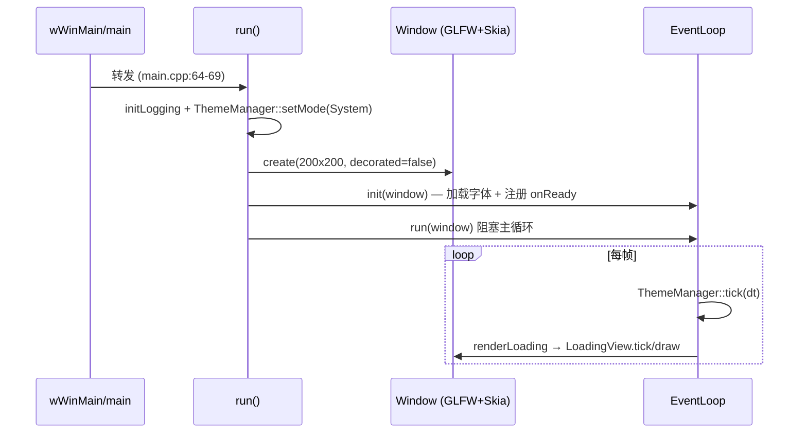
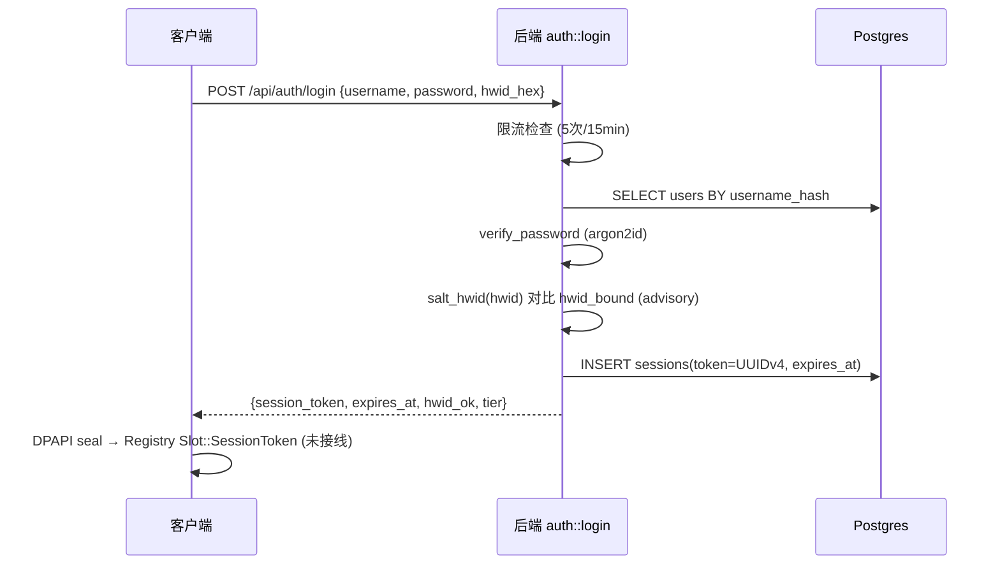
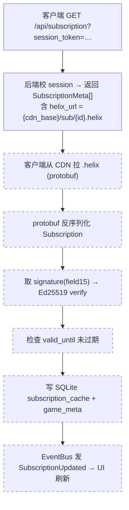
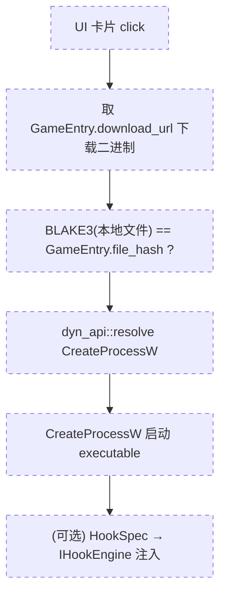

# 端到端数据流

本页沿「启动 → 登录 → 订阅刷新 → 启动游戏」四段追踪数据在三个信任域之间的流动。**每段都明确标注
实现状态**：已落地（代码可验证）、契约（proto/头文件声明但无调用链，`unverified`）。这是对早期
`docs/ARCHITECTURE.md` 数据流的取代——旧页把大量设计意图写成了既定流程。

!!! warning "总体现状"
    客户端主入口 `src/app/main.cpp` 仍是 Phase 1 占位：只初始化日志、开一个 200×200 无边框窗口并跑事件循环
    （`src/app/main.cpp:31-60`）。全 `src/app` 内对 `HttpClient` / `Registry` / `SqliteStore` / `Subscription` 的引用数为
    **0**，且客户端源码内**不存在 `Launcher` 类**。因此下面第 2~4 段涉及跨模块编排的部分，多为「构件能力 + 契约」，
    尚未串成调用链。

## 1. 启动（已落地）

- `run()` 顺序见 `src/app/main.cpp:31-60`；主循环 `EventLoop::run` 见 `src/app/event_loop.cpp:33-54`。
- `LoadingView` 在 `kFakeDelaySec = 1.5s` 后触发 `onReady`，把 `AppPhase` 从 `Loading` 切到 `Login`（`event_loop.cpp:14-18`）——这是当前**唯一实际发生的状态转移**。

!!! warning "加载是假延时，不是真实心跳"
    `LoadingView` 头注释说应在「后端心跳成功 + 本地存储就绪」后触发 `onReady`，但当前用固定 1.5s 模拟，且切到
    `Login`/`Main` 后**仍渲染 LoadingView**（`event_loop.cpp:44-51`）。登录页、主界面尚未接入事件循环。详见
    [客户端 · App 与 UI 层](../client/app-ui.md)。

## 2. 登录（后端已落地 · 客户端未接线）

- 后端登录状态机完整实现，见 [后端 · 认证/会话](../backend/auth-session.md#4)（`auth.rs:265-400`）。
- 客户端登录 UI（`LoginView`）已声明完整交互面（`login_view.h:19-42`），但 `views/` 下**只有 `loading_view.cpp` 有实现**，`LoginView::OnSubmitFn` 无注入点、无触发点。整条登录链在客户端侧 `unverified（未接线）`。
- HWID 采集 `HwidCollector::collectFingerprint()`（`src/native/hwid.cpp:303-316`）能力存在，但无 net/app 调用者。详见 [客户端 · 加密与原生](../client/crypto-native.md)。

!!! danger "HWID 仅作咨询信号，不阻断登录"
    后端 HWID 不匹配时只把 `hwid_ok=false` 回给客户端，仍发放完整 session（`auth.rs:342-358`）。功能限制依赖
    客户端自觉，而客户端不可信。这是安全审计 High 项，详见 [安全与信任模型](../security/index.md#hwid) 与
    [加密链 §2.3](../security/crypto-chain.md)。

## 3. 订阅刷新（后端发 URL 已落地 · 客户端拉取/验签/缓存未落地）

（实线 = 已落地；虚线 = 契约存在但客户端实现未落地）

- 后端 `GET /subscription` 只返回 `SubscriptionMeta`（`id/name/helix_url/updated_at`），`helix_url` 拼成 `{cdn_base}/sub/{id}.helix`（`crates/api/src/subscription.rs:23-56`）。真正的签名 blob 由 CDN 分发。
- `SqliteStore` 的 `subscription_cache` / `game_meta` 三张表 schema 就位（`src/storage/sqlite_store.cpp:23-42`），但**无任何读写调用**——缓存流是设计而非实现。
- `EventBus::publish<SubscriptionUpdated>` 机制就绪（`src/core/event_bus/event_bus.h`），但 `SubscriptionUpdated` 事件类型在代码中未定义具体结构，仅注释举例。

详见 [客户端 · 网络/存储/核心 §4](../client/net-storage-core.md#4) 与 [Signer / Proto](../data/signer-proto.md)。

## 4. 启动游戏（契约 · 客户端全未落地） {#4}

（整条虚线 = 契约存在，客户端**无任何实现**）

当前客户端唯一真实存在的相关构件是 `native::dyn_api::resolve`（动态解析 Win32 API，`src/native/dyn_api.cpp:8-22`），其头注释用法示例正是解析 `CreateProcessW`（`dyn_api.h:5-6`）。

!!! danger "客户端验签 / BLAKE3 校验 / 进程创建全部未实现"
    在 `src/` 与 `tools/preview-d2d/` 中均**未找到**任何 Ed25519 验签、BLAKE3 校验或游戏启动实现。信任模型的
    核心承诺「客户端拒绝无效签名」目前**没有代码兜底**。签名侧（signer 的 Ed25519+BLAKE3）与契约（proto）
    都存在，缺的是客户端消费侧。详见 [加密链 §4.2](../security/crypto-chain.md) 与 [Signer / Proto §1.5](../data/signer-proto.md#15)。

## 各段实现状态速查

| 段 | 后端 | 客户端 | 说明 |
|---|---|---|---|
| 启动 | — | 已落地 | 仅 LoadingView，登录/主界面未接入 |
| 登录 | 已落地 | 未接线 | LoginView 无实现；HWID 采集能力在但无调用者 |
| 订阅刷新 | 部分（发 URL） | 未落地 | SQLite schema 就位、无读写；EventBus 就绪、无事件类型 |
| 启动游戏 | — | 未落地 | 仅 dyn_api 解析机制；无验签/BLAKE3/CreateProcessW |
