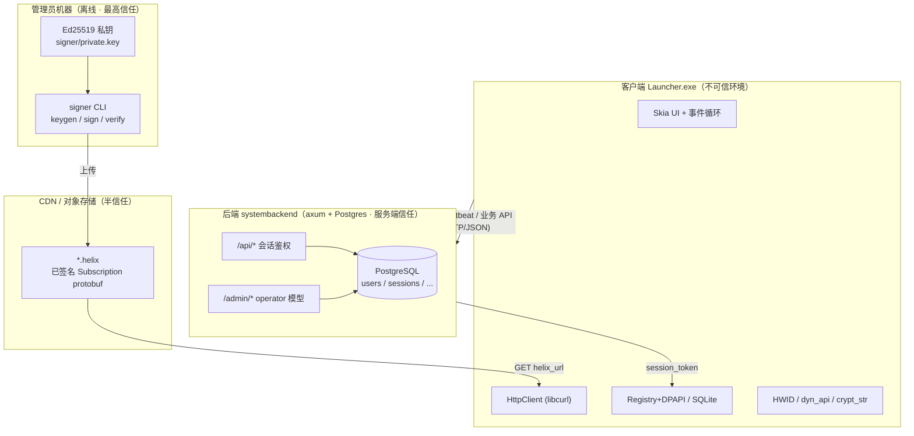

# 架构总览

本页给出 Launcher 的进程边界、三个信任域与组件拓扑的高层视图。它取代早期的单页
`docs/ARCHITECTURE.md`——尤其是数据流部分，本文档集用 [端到端数据流](data-flow.md) 逐段标注了实现状态，
用 [加密与验证链](../security/crypto-chain.md) 展开信任模型的密码学细节。

## 三个信任域

Launcher 的安全模型建立在三个信任级别截然不同的域之上：

信任模型三句话（密码学细节见 [加密与验证链](../security/crypto-chain.md)）：

- **客户端二进制**：公开物，持硬编码签名公钥（公开）与 HWID 盐（编译进二进制、半公开）。默认可被逆向 / 篡改，任何仅靠客户端自觉执行的策略都不构成安全边界。
- **后端服务器**：持密码哈希（Argon2id）、HWID 哈希（SHA-256 二次盐化）、session token、`admin_password`；**不持签名私钥**。被打穿最多能改 `helix_url` 指向，（设计上）伪造不了 `.helix` 签名。
- **管理员机器**：唯一持 Ed25519 私钥处，离线 `sign` → 上传 CDN。

!!! danger "信任模型的核心承诺当前有缺口"
    「服务器被打穿也伪造不了签名，因为客户端验签」是信任模型的中心假设——但**客户端验签在代码里尚不存在**
    （见 [数据流 · 启动游戏](data-flow.md#4)、[加密链 §4.2](../security/crypto-chain.md)）。此外 HWID 门禁不强制、admin 存在
    `?key=` 明文引导后门。这些是**当前而非假想**的缺口，详见 [安全与信任模型](../security/index.md)。

## 组件拓扑

| 域 | 组件 | 技术栈 | 关键文件 |
|---|---|---|---|
| 客户端 | App / 事件循环 / 窗口 | C++20, GLFW, Skia (GL Ganesh) | `src/app/*`, `src/ui/render/skia_renderer.*` |
| 客户端 | UI 视图 / 动画 / 主题 | Skia, 自研补间动画 | `src/ui/views/*`, `src/ui/anim/*`, `src/ui/theme/*` |
| 客户端 | 网络 | libcurl（仅 GET） | `src/net/http_client.*` |
| 客户端 | 存储 | Registry+DPAPI（敏感）/ SQLite（缓存） | `src/storage/registry.*`, `src/storage/sqlite_store.*` |
| 客户端 | 加密 / 原生 | libsodium SHA-256, DPAPI, WMI/SetupAPI, dyn_api | `src/crypto/*`, `src/native/*` |
| 后端 | HTTP 服务 | Rust, axum 0.7, tokio | `SystemBackend/crates/api/src/main.rs` |
| 后端 | 认证 / 共享加密 | argon2, sha2, sqlx | `crates/api/src/auth.rs`, `crates/shared/src/hashing.rs` |
| 后端 | 管理后台 | axum SSR (askama), HMAC cookie | `crates/api/src/admin*.rs` |
| 数据 | 数据库 | PostgreSQL, 18 个迁移 | `SystemBackend/migrations/0001..0018` |
| 签名 | 离线 CLI | Rust, ed25519-dalek, blake3, prost | `SystemBackend/crates/signer/src/main.rs` |
| 契约 | proto schema | proto3 (prost) | `src/proto/subscription.proto` |

!!! note "proto schema 跨仓共用"
    Rust `proto` crate 的 `build.rs` 直接编译**客户端目录**下的 `../../../src/proto/subscription.proto`
    （`SystemBackend/crates/proto/build.rs:7`），因此客户端与后端共用同一份 schema。详见 [Signer / Proto](../data/signer-proto.md#2-proto)。

## 进程边界

- **客户端**：单进程。当前（Phase 1）只有主线程跑 UI 事件循环（`src/app/event_loop.cpp:33-54`）；设计中的后台 HTTP/IO 线程尚未接入。
- **后端**：单进程 axum，Tokio 运行时（`crates/api/src/main.rs`）。传输层是否 HTTPS 取决于是否配置 TLS 证书，否则纯 HTTP（`main.rs:79-90`）。
- **signer CLI**：独立进程，**只在管理员机器**跑，不在服务器（`signer/src/main.rs:7`）。

## 传输与端口

- 后端监听端口与 TLS 均来自配置。配了 `tls_cert_path`/`tls_key_path` 走 rustls HTTPS，否则纯 HTTP（`crates/api/src/main.rs:79-90`）。生产环境按部署事实以 HTTP 运行。
- 客户端 `HttpClient` 目前只有 GET、明文 HTTP、无证书 pinning（`src/net/http_client.cpp:39` 仅有 TODO）。详见 [客户端 · 网络](../client/net-storage-core.md#http)。

!!! warning "明文传输是已知弱点"
    生产以 HTTP 运行时，session token 以明文 query/JSON 传输。这与安全审计一致，属已知传输层弱点，
    在 [加密链 §4.3](../security/crypto-chain.md) 与 [安全与信任模型](../security/index.md) 中交叉引用。
