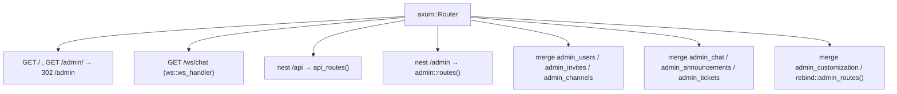
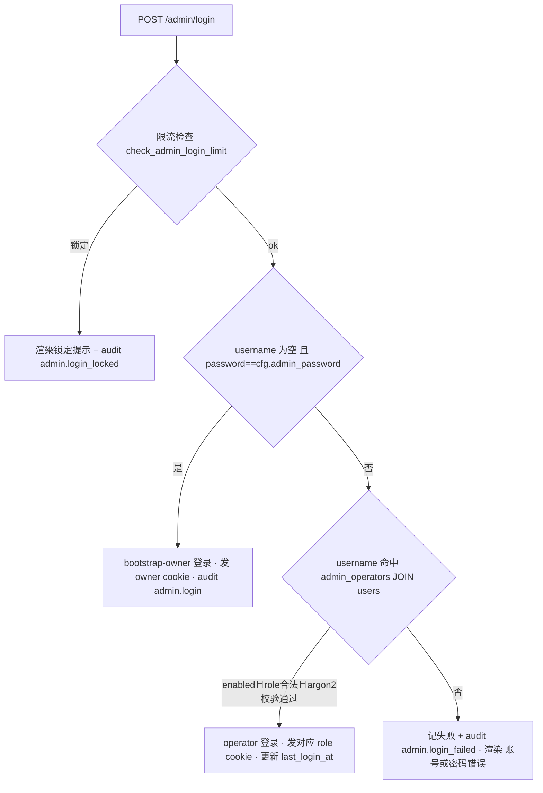

# 后端 · API 与管理后台

本页描述 `SystemBackend/crates/api` 的 axum 路由拓扑、客户端会话鉴权、管理后台（Admin SSR）鉴权与 operator
角色模型，以及各端点目录。所有结论均引用实读的 `文件:行号`。认证状态机细节见 [认证/会话](auth-session.md)，
密码学端到端视角见 [加密与验证链](../security/crypto-chain.md)。

## 1. 服务装配与路由树

服务入口在 `main.rs`。启动时加载 `config.toml`（`main.rs:41-44`）、连接 Postgres 并跑 migration（`:46-47`）、构造 `AppState`（`:49`），随后组装 `axum::Router`。顶层路由挂载（`main.rs:51-76`）：

关键细节：

- `/api` 用 `nest`，其余 admin 模块用 `merge`。被 merge 的模块内部各自声明**完整绝对路径**（既有 `/admin/...` SSR 页面，也有 `/api/admin/...` JSON 端点），例如 `admin_users::routes()` 同时挂 `/admin/users`（`admin_users.rs:633`）与 `/api/admin/users`（`admin_users.rs:638`）。
- 全局中间件：`TraceLayer`（`main.rs:71`）、`RequestBodyLimitLayer` 100MB（`main.rs:73-75`，用于媒体上传）。
- 传输层：配了 `tls_cert_path`/`tls_key_path` 时走 rustls HTTPS，否则纯 HTTP（`main.rs:79-90`）。生产为 HTTP。rustls 0.23 需显式安装 crypto provider（`main.rs:37-39`）。

!!! warning "端口暴露与明文传输"
    生产后端以 HTTP（非 TLS）监听（`main.rs:86-89` 的 else 分支），会话 token 以明文 query/JSON 传输（见 §2）。
    这与安全审计一致，属于已知弱点，详见 [加密链 §4.3](../security/crypto-chain.md)。

## 2. 客户端 API 鉴权模型（session token）

客户端所有 `/api/*` 业务端点用**会话 token** 鉴权，而非 admin cookie。核心 helper 有两份等价实现：

- `profile::auth_user`（`profile.rs:20-29`）
- `media::auth_user`（`media.rs:33`，被 `ws.rs:10`、`chat.rs`、`community.rs:1`、`market.rs:3` 复用）

逻辑一致：`SELECT user_id FROM sessions WHERE token = $1 AND expires_at > now()`，命中返回 `Uuid`，否则 `401 no session`（`profile.rs:21-28`）。token 传递方式：GET 走 query（如 `ProfileQuery.session_token`，`profile.rs:45-48`）、POST 走 JSON body、上传走 multipart 字段（`chat.rs:246,255`）、WebSocket 走 query（`ws.rs:64-78`，鉴权在 upgrade 之前，失败直接 401）。

!!! note "两套「管理员」判定并存"
    社区/工单侧的 `/api/admin/*`（`community.rs`）**不走 operator 模型**，而是用客户端 session token + `users` 表的
    `is_admin`/`role` 字段判定（`community.rs:44-58` 的 `user_role`，`community.rs:1195-1204` 的 `update_ticket_status`）。
    这与 §4 的 admin cookie/operator 模型是**两条独立信任链**：一条面向桌面客户端里的管理员用户，一条面向 Web 管理
    后台的 operator。审计与理解权限时需分开看待。

## 3. 端点目录

### 3.1 客户端 API（`/api`，`api_routes()` in `main.rs:94-224`）

鉴权列：`session` = 需有效 session token；`none` = 无鉴权；`admin(session)` = session token + `users.is_admin`；`operator/key` = §4 的 operator 或 `?key=` 旁路。

| 方法 | 路径 | 处理器 | 鉴权 |
|---|---|---|---|
| POST | /api/auth/register | auth::register (`auth.rs:49`) | none |
| POST | /api/auth/login | auth::login | none |
| POST | /api/auth/logout | auth::logout (`auth.rs:407`) | 删 token（body 提供 token） |
| POST | /api/heartbeat | heartbeat::heartbeat | session |
| GET | /api/subscription | subscription::list_for_user | session |
| POST | /api/hwid/rebind/request | rebind::submit (`rebind.rs:41`) | session |
| GET | /api/hwid/rebind/list | rebind::list_for_user | session |
| GET/POST | /api/profile* (profile, nickname, password, avatar, login-history, status, update, tags*) | profile::* (`main.rs:108-120`) | session |
| GET | /api/profile/peer/:key , /api/avatar/:id | profile::* | session |
| POST/GET | /api/media/upload , /api/media/:sha/:name | media::upload / download (`main.rs:122-123`) | session |
| POST/GET | /api/chat/* (dm, group, list, official, send, history, sync, search, read, react, delete) | chat::* (`main.rs:125-135`) | session |
| GET/POST | /api/chat/moderation/{member,mute,unmute} | chat::* (`main.rs:136-138`) | session（内部校验群权限） |
| GET | /api/community/bootstrap , POST /api/community/checkin | community::* | session |
| GET/POST | /api/forum/topics | community::list/create_topic | session |
| * | /api/ticket*, /api/tickets* | community::* (`main.rs:146-157`) | session |
| GET/POST | /api/admin/tickets , /api/admin/tickets/:id/{status,visibility,protect} | community::* (`main.rs:158-170`) | **admin(session)**（`community.rs:1202`） |
| POST | /api/admin/messages/:id/edit | community::admin_edit_message | admin(session) |
| GET/POST | /api/announcements/active , /:id/{read,ack} | community::* | session |
| POST | /api/admin/announcements | community::create_announcement | admin(session) |
| GET/POST | /api/client/settings | client_settings::{get,upsert} | session |
| POST/GET | /api/sticker* (create, delete, pack CRUD, install, share, cover, reorder, by-short, public, mine) | sticker::* (`main.rs:191-210`) | session |
| GET | /api/market/{categories,listings,listings/:id} | market::* | session |
| POST | /api/market/listing/create , /purchase , /review | market::* | session |
| GET | /api/market/orders/mine | market::my_orders | session |
| POST | /api/market/admin/grant_credit | market::admin_grant_credit (`market.rs:459`) | **operator/key**，权限 `admin.users.manage`（`market.rs:464-469`） |

### 3.2 管理后台端点（SSR + JSON），按模块

所有下列端点走 §4 的 admin cookie / operator 模型（`/api/admin/...` 变体额外支持 `?key=` 旁路，见 §5）。

| 方法 | 路径 | 处理器 | 需权限 |
|---|---|---|---|
| GET | /admin , /admin/login (GET+POST) , /admin/logout | admin::{dashboard,login_*,logout} (`admin.rs:709-715`) | cookie / bootstrap |
| GET | /admin/users | admin_users::users_page (`admin_users.rs:633`) | admin.users.read |
| POST | /admin/users/:id/{edit,reset-pw,reset-hwid,delete} | admin_users::* (`admin_users.rs:634-637`) | admin.users.manage（+ B1/B2 guard） |
| GET | /api/admin/users | admin_users::list_users (`admin_users.rs:638`) | admin.users.read |
| POST | /api/admin/users/:id , /:id/reset-pw | admin_users::{patch_user,admin_reset_password} (`admin_users.rs:639-640`) | admin.users.manage（+ B1/B2） |
| GET/POST | /admin/invites | admin_invites::{list_page,create_submit} (`admin_invites.rs:254`) | admin.invites.read/manage |
| POST | /admin/invites/:code/revoke | admin_invites::revoke | admin.invites.manage |
| GET | /api/admin/invites | admin_invites::list_json (`admin_invites.rs:256`) | admin.invites.read |
| GET | /admin/channels | admin_channels::channels_page (`admin_channels.rs:656`) | admin.channels.read |
| POST | /admin/channels/:id/{rename,policy,clear} | admin_channels::* (`admin_channels.rs:657-659`) | admin.channels.manage |
| GET/POST | /admin/chat , /admin/chat/send | admin_chat::{page,send_submit} (`admin_chat.rs:650-651`) | admin.chat.read/send |
| GET/POST | /admin/announcements | admin_announcements::{list_page,create_submit} (`admin_announcements.rs:203`) | admin.announcements.* |
| GET | /admin/tickets , /admin/tickets/:id | admin_tickets::{tickets_page,ticket_detail_page} (`admin_tickets.rs:713-714`) | admin.tickets.read |
| POST | /admin/tickets/:id/{status,visibility} , /:ticket_id/messages/:message_id/edit | admin_tickets::* (`admin_tickets.rs:715-720`) | admin.tickets.manage |
| POST | /admin/ticket-categories , /:id | admin_tickets::{create,update}_category (`admin_tickets.rs:721-722`) | admin.tickets.manage |
| GET/POST | /admin/config | admin_customization::{config_page,save_config} (`admin_customization.rs:892`) | admin.config.read/write |
| POST | /admin/config/revisions/:id/rollback | admin_customization::rollback_config (`admin_customization.rs:894-896`) | admin.config.write |
| GET/POST | /admin/operators | admin_customization::{operators_page,save_operator} (`admin_customization.rs:897`) | **admin.operators.manage（仅 owner）** |
| GET | /admin/audit | admin_customization::audit_page (`admin_customization.rs:898`) | admin.audit.read |
| GET | /admin/rebind | rebind::admin_pending_page (`rebind.rs:323`) | admin.rebind.read |
| POST | /admin/rebind/:id/{approve,deny} | rebind::{form_approve,form_deny} (`rebind.rs:324-325`) | admin.rebind.manage |
| POST | /api/admin/rebind/:id/{approve,deny} | rebind::{admin_approve,admin_deny} (`rebind.rs:326-327`) | admin.rebind.manage / key |

## 4. 管理后台鉴权与 operator 角色模型 {#4}

### 4.1 会话载体：签名 cookie

Admin 会话不入库（bootstrap 情形），而是放进签名 cookie `launcher_admin`（`admin.rs:25`），有效期 12 小时（`admin.rs:26`）。cookie 明文格式为 `issued_at:username:user_id:role:sig`（`admin.rs:144-162`），`sig` 是 HMAC-SHA256（`admin.rs:100-118`）。cookie 属性：`Path=/admin; HttpOnly; SameSite=Strict`，仅在有 TLS cert 时加 `Secure`（`admin.rs:252-273`）。

校验链 `admin_session`（`admin.rs:203-246`）：

1. 从 Cookie 头解析 `launcher_admin`（`admin.rs:204-212`）。
2. `parse_admin_cookie_value`（`admin.rs:164-201`）：校验 role 白名单 `owner|admin|operator|auditor`（`admin.rs:180`）、过期与签发时间（`admin.rs:183-186`）、HMAC（`admin.rs:187-189`）。
3. bootstrap 会话（`username==bootstrap && user_id==bootstrap`，`admin.rs:174`）直接放行（`admin.rs:213-215`）。
4. 非 bootstrap：回查 `admin_operators` 表，校验 `enabled`、`user_id` 与 cookie 一致、role 白名单（`admin.rs:216-236`），并以 DB 的 `operator_role`/`display_name` 覆盖会话（`admin.rs:237-245`）。

### 4.2 登录流程 `login_submit`（`admin.rs:309-412`）

- 限流：15 分钟窗口内失败 5 次即冷却 15 分钟（`admin.rs:27-29`），按 `admin:<username>` 或 `admin:bootstrap` 分桶（`admin.rs:51-58`），复用 `AppState.login_attempts`（`state.rs:17`）。
- Bootstrap 分支：空用户名 + 明文口令等于 `cfg.admin_password`（`admin.rs:336`），成功即以 `owner` 角色发 cookie（`admin.rs:345`）。
- Operator 分支：`admin_operators JOIN users`，校验 `enabled` + role 白名单 + argon2id 口令（`admin.rs:360-372`）。
- 所有登录/失败/锁定均写 `audit_log`（`admin.rs:338-343,378-391,399-406`）。

### 4.3 角色权限矩阵 `can()`（`admin_customization.rs:189-226`）

| role | 权限 |
|---|---|
| owner | **全部**（`admin_customization.rs:191`，无条件 true） |
| admin | 除 `admin.operators.manage` 外全部（`:192`） |
| operator | 白名单：config/channels/chat/users.read/market.read/invites/rebind/tickets/announcements 的 read+manage（`:193-211`，注意 users 仅 read，chat 有 send） |
| auditor | 只读：audit.read + 各模块 .read（`:212-223`） |
| 其他 | 全部拒绝（`:224`） |

守卫入口：

- `require_actor(headers, state, permission)`（`admin_customization.rs:240-253`）：SSR 用，无会话 → 302 `/admin/login`；有会话无权限 → 302 `/admin?err=permission`。
- `require_actor_or_admin_key(...)`（`admin_customization.rs:255-274`）：JSON API 用，见 §5。
- `actor_from_session`（`admin_customization.rs:228-238`）把 `AdminSession` 转成 `AdminActor{name, role, display_name}`；bootstrap 的 `actor_name()` = `"bootstrap-owner"`，否则 `"operator:<username>"`（`admin.rs:41-48`）。

### 4.4 owner-only 提权守卫（B1/B2，`admin_users.rs:34-85`）

针对「admin→owner 越权」的两条守卫：

- **B1 `guard_role_assignment`**（`admin_users.rs:42-55`）：非 owner 不得把用户 `role` 写成 `owner`/`super_admin`（`PRIVILEGED_ROLES`，`admin_users.rs:34`）。在 `patch_user`（`admin_users.rs:175`）与 SSR `user_edit_submit`（`admin_users.rs:438-440`）处调用。
- **B2 `guard_target_not_privileged_operator`**（`admin_users.rs:59-85`）：非 owner 不得重置「绑定了 owner/admin operator 的用户」密码（否则可重置后登录 /admin 冒充）。查 `admin_operators` 里该 user_id 的 `enabled` 角色（`admin_users.rs:69-83`）。在 `admin_reset_password`（`admin_users.rs:220`）与 SSR `user_reset_pw_form`（`admin_users.rs:491-492`）处调用。owner 直接放行（`admin_users.rs:64`）。B2 用运行时 `sqlx::query_scalar`（非编译期宏），为避开离线 `.sqlx` 缓存依赖（`admin_users.rs:67-68` 注释）。

审计写入统一走 `write_audit`（`admin_customization.rs:276-293`），落 `audit_log` 表并调 `audit::event`。

## 5. 已知安全弱点（对照安全审计） {#5}

!!! danger "admin `?key=` 旁路（`require_actor_or_admin_key`）"
    所有 `/api/admin/*` JSON 端点（用户管理、market grant_credit、rebind approve/deny）都可用 query/body 里的
    `key=<admin_password>` 直接鉴权，**无需任何 cookie 会话**（`admin_customization.rs:255-274`）。当无会话且
    `key == cfg.admin_password` 时，直接返回 `AdminActor::bootstrap()`，即完整 owner 权限（`:270-272`）；有会话但权限
    不足时也可用 key 提权到 bootstrap-owner（`:265-266`）。影响：明文 admin 口令一旦以 URL query 形式传输（生产为
    HTTP，见 §1），会落进代理/访问日志、浏览器历史，等同 owner 全权凭据泄露。使用该旁路的端点：`admin_users.rs:107,159,212`、`market.rs:464`、`rebind.rs:153,204`。

!!! danger "cookie 签名密钥 = admin_password（HMAC key 复用）"
    admin cookie 的 HMAC-SHA256 密钥直接用 `cfg.admin_password` 作为 key（`admin.rs:107-108,131-132`）。同一秘密既是
    **登录口令**又是**会话签名密钥**又是 **`?key=` 旁路凭据**。三重复用意味着：口令一旦泄露即可离线伪造任意 role 的
    合法 cookie；且轮换口令会立即使所有现存 cookie 失效。建议独立的会话签名密钥（此处仅记录现状，不改代码）。

!!! danger "bootstrap-owner 长期后门"
    只要知道 `cfg.admin_password`，无用户名即可登录为 owner（`admin.rs:336-346`），该身份不在 `admin_operators` 表内、
    无法被禁用或降权、审计中显示为 `bootstrap-owner`（`admin.rs:43-45`）。这是超越 operator 模型的常驻最高权限入口。

!!! note "HWID 未强制（登录侧）"
    `auth::login` 计算 `hwid_ok` 并写 login_history，但不因 HWID 不匹配拒绝登录，仅在响应里返回 `hwid_ok` 标志
    （`auth.rs:382-399`）。详见 [认证/会话 §5](auth-session.md#5) 与 [安全与信任模型](../security/index.md#hwid)。

### 已在源码中修复的历史项

- **rebind 过期 token 旁路**：`rebind::submit` 现在校验 `expires_at > now()`（`rebind.rs:46`），MEMORY 中记录的「过期 session token 被 rebind::submit 接受」在当前源码已收敛。（部署状态未在此验证。）

## 6. 错误处理与信息泄露防护

`error.rs` 提供 `internal`/`internal_msg`（`error.rs:17-40`）：真实错误 + `#[track_caller]` 定位走 `tracing::error!`，返回给客户端只有通用 `"internal server error"`，避免泄露 SQL/schema/路径。业务 handler 普遍 `.map_err(internal)?`。

## 关键文件索引

- 路由装配：`crates/api/src/main.rs`
- 客户端会话鉴权：`crates/api/src/profile.rs:20`、`media.rs:33`
- Admin cookie/登录/HMAC：`crates/api/src/admin.rs`
- 角色矩阵 / 守卫入口 / `?key=` 旁路：`crates/api/src/admin_customization.rs:189,240,255`
- owner-only B1/B2 守卫：`crates/api/src/admin_users.rs:34-85`
- WebSocket：`crates/api/src/ws.rs`；rebind：`crates/api/src/rebind.rs`
- 社区侧 `/api/admin/*`（独立信任链）：`crates/api/src/community.rs:44,1195`
- 配置字段：`crates/shared/src/config.rs:6,21,24,28,35`

**未验证项**：各处理器内部业务逻辑（chat 群权限、market 交易一致性）未逐一展开；`community.rs` 的 `is_admin` 语义来自 `users` 表字段，其写入路径未追至源头；生产实际部署二进制是否已含 rebind 修复未验证。
