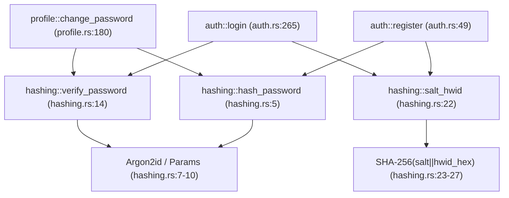
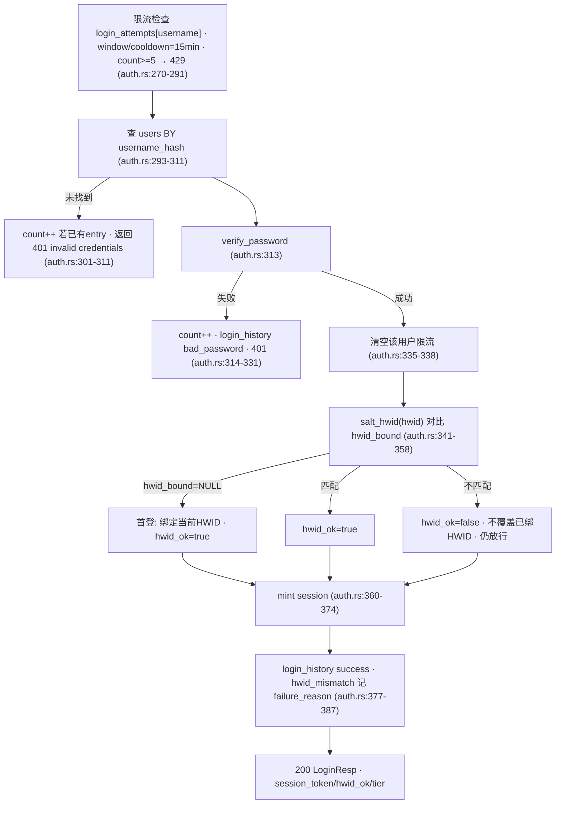

# 后端 · 认证 / 会话 / 共享加密

本页逐条对照 `SystemBackend/crates` 真实源码，描述认证域（注册/登录/登出/改密）、HWID 咨询式绑定、
session 生命周期与 `launcher_shared::hashing` 共享加密面。所有敏感值（HWID 盐、`admin_password`、连接串等）
仅以名称/角色引用。密码学的端到端视角见 [加密与验证链](../security/crypto-chain.md)。

## 1. 模块职责与调用图

认证域三个文件，注册在 `/api` 前缀下（`main.rs:61` `.nest("/api", api_routes(...))`）：

| 端点 | 路由注册 | 处理函数 | 文件:行 |
|---|---|---|---|
| `POST /api/auth/register` | `main.rs:98` | `auth::register` | `auth.rs:49` |
| `POST /api/auth/login` | `main.rs:99` | `auth::login` | `auth.rs:265` |
| `POST /api/auth/logout` | `main.rs:100` | `auth::logout` | `auth.rs:407` |
| `POST /api/profile/password` | `main.rs:110` | `profile::change_password` | `profile.rs:180` |

共享加密原语集中在 `launcher_shared::hashing`（`shared/src/hashing.rs`），被认证域全部三条写路径复用：



会话解析（session token → `user_id`）在各业务模块中以**同一条 SQL 拷贝**实现，而非统一辅助函数。已确认存在于：`profile.rs:20`、`media.rs:33`、`rebind.rs:46`/`rebind.rs:108`、`subscription.rs:28`，语句均为：

```sql
SELECT user_id FROM sessions WHERE token = $1 AND expires_at > now()
```

## 2. 共享加密面（`shared/src/hashing.rs`）

- **`hash_password(password, mem_kib, iters)`**（`hashing.rs:5-12`）：`SaltString::generate(OsRng)` 随机盐 → `Params::new(mem_kib, iters, 1, None)`（`p_cost=1`，无固定输出长度）→ `Argon2id` `Version::V0x13` → 输出 PHC 编码串（盐与参数自带）。成本参数由配置注入：`argon_memory_kib` 默认 `128*1024` KiB = 128 MiB，`argon_iterations` 默认 `10`（`config.rs:12-15,55-60`）。
- **`verify_password(password, encoded)`**（`hashing.rs:14-19`）：`PasswordHash::new(encoded)` 从存储串解析盐/参数，用 **`Argon2::default()`** 校验（默认参数即可，因参数编码在 PHC 串内），`.is_ok()` 归一为 `bool`。
- **`salt_hwid(hwid_hex, server_salt)`**（`hashing.rs:22-28`）：`SHA-256(server_salt || hwid_hex)` 的 hex。**这是无盐迭代的单遍 SHA-256**，非慢哈希。两个域各用一把服务端盐：HWID 用 `launcher.hwid.salt.v1`（`auth.rs:142,341`），username 用 `launcher.user.salt.v1`（`auth.rs:66,296`）。username 走 `salt_hwid` 得到 `username_hash`，是登录时唯一的查找键。

!!! warning "HWID / username 仅单遍 SHA-256"
    密码哈希是 Argon2id（慢哈希），但 HWID/username 只做一遍 SHA-256（`salt_hwid`，`hashing.rs:23-27`）——速度快，
    一旦服务端盐泄露即可对已知 HWID/username 空间做离线比对；username 空间尤其小。盐是编译期常量、半公开。

## 3. 注册状态机（`auth::register`, `auth.rs:49-243`）

```mermaid
graph TD
  A["输入校验 · username 3-32/字符集 · pw>=8 · hwid_hex len==64 (auth.rs:54-63)"] --> B["占用检查 username_hash OR username (auth.rs:66-77)"]
  B -->|存在| B409["409 username taken"]
  B --> C{require_invite_code? (auth.rs:80)}
  C -->|是| D["SELECT ... FOR UPDATE 校验 revoked/expired/quota (auth.rs:88-108)"]
  D -->|无效| D403["403"]
  C -->|否| E
  D --> E["UID 生成 最多重试5次 (auth.rs:116-133)"]
  E --> F["argon2id hash_password + salt_hwid(hwid) (auth.rs:136-142)"]
  F --> G["INSERT users (auth.rs:146-162)"]
  G --> H{有邀请码? (auth.rs:169)}
  H -->|是| I["条件 UPDATE 自增 use_count · rows_affected==0 → 删用户+403 (auth.rs:170-192)"]
  H -->|否| J
  I --> J["mint session (auth.rs:204-216)"]
  J --> K["audit_log + login_history (auth.rs:219-233)"]
  K --> L["200 RegisterResp 含 session_token"]
```

要点：

- 用户名校验 `validate_username`（`auth.rs:33-47`）：长度 3-32、字符集 `[a-zA-Z0-9_.-]`、不能以 `.`/`-` 开头。密码 `>=8`。`hwid_hex` **前置校验**必须恰好 64 字符且全为 ascii-hex（`req.hwid_hex.len() != 64 || !...all(is_ascii_hexdigit)`，`auth.rs:58-63`），与 `login`（`auth.rs:270`）对齐——防非 ASCII 边界切片 panic（原 H-2 守卫，见 [安全 · 已修复历史项](../security/index.md)）。
- **邀请码并发防抢**：设计者在 `auth.rs:164-168` 注释明确指出第 88 行的 `SELECT ... FOR UPDATE` **不起作用**（锁随连接归还即释放），真正的串行化靠 `auth.rs:170-178` 带 `use_count < max_uses AND revoked_at IS NULL AND (expires_at ...)` 条件的原子 `UPDATE`，`rows_affected()==0` 即抢码失败并**补偿删除已建用户行**（`auth.rs:185-192`）。
- 默认 `nickname = username`（`auth.rs:143`）。UID 为 7 位不前导 0 的数字（`shared/src/uid.rs:6-10`，仅展示，不参与查找），冲突重试上限 5 次。
- 注册即自动登录，直接铸造 session（无二次 login）。

## 4. 登录状态机（`auth::login`, `auth.rs:265-400`） {#4}



限流细节（`auth.rs:269-291`，进程内 `Mutex<HashMap<String, LoginAttemptEntry>>`，`state.rs:7-17`）：

- 键为**明文 username**（未哈希）。滑动窗口 15 分钟、冷却 15 分钟，`count>=5` 触发 `429`，`entry.first_at.elapsed() > window` 时归零重开窗。
- 反枚举（M-2 时序）：未知用户命中时跑一次 `verify_password("x", &s.dummy_password_hash)`（`auth.rs:316-318`），`dummy_password_hash` 在 `AppState::new` 用**与真实密码相同的 argon2 成本参数**启动预算（`state.rs:23,29-34`），使未知用户与已知用户耗时一致，消除用户枚举时序旁路。仍统一返回 `401 invalid credentials`，且**未知用户不写 `login_history`**（`user_id` 为 `UUID NOT NULL`，无对应行，`auth.rs:319-320` 注释）。
- 登录成功清空该用户限流 entry（`auth.rs:336-338`）。

!!! warning "限流为进程内状态，非持久 / 非集群共享"
    `login_attempts` 是 `AppState` 内的 `Mutex<HashMap>`（`state.rs:19`），进程重启即清空，且多实例部署下各实例
    独立计数——横向扩容或频繁重启会削弱暴力破解防护。锁**已 poison-safe**：`s.login_attempts.lock().unwrap_or_else(|e| e.into_inner())`（`auth.rs:276`）在锁中毒时恢复内部值而非 panic（记忆中「`.lock().unwrap()` 锁中毒会 panic」的旧陈述已过时）。另有 `map.len() > 10_000` 时按 30 分钟窗清理陈旧 entry 防内存膨胀（M-3，`auth.rs:278-280`）。

## 5. HWID 咨询式绑定（advisory） {#5}

- 首次登录（`hwid_bound IS NULL`）绑定当前 `salt_hwid(hwid_hex, launcher.hwid.salt.v1)`（`auth.rs:346-356`）。
- 后续登录仅比较，不匹配时**不覆盖**原绑定、`hwid_ok=false`，但**仍然发放 session 正常登录**（`auth.rs:342-345`）。设计意图见注释：换机/重装用户仍要能进来发工单、走重绑流程；`hwid_ok` 回传客户端做功能限制。不匹配会以 `failure_reason=hwid_mismatch` 记入 `login_history`（成功行，`auth.rs:383`）。

!!! danger "HWID 绑定未被强制执行（安全审计 High）"
    服务端在 HWID 不匹配时不拒绝、不降级 session 权限，仅在响应体里放一个 `hwid_ok: bool`（`auth.rs:262,398`），
    由**客户端自我约束**。任何直接调用 HTTP API 的攻击者可无视 `hwid_ok=false` 继续以完整会话访问受保护端点——
    机器绑定形同虚设。这是本审计的最高等级发现之一。参见 [安全与信任模型](../security/index.md#hwid) 与
    [加密链 §2.3](../security/crypto-chain.md)。合法换机的正途是 HWID 重绑流程（`POST /api/hwid/rebind/request`，
    管理员后台审核，`rebind.rs`）。

## 6. 会话生命周期

- **铸造**：`token = Uuid::new_v4().to_string()`（v4 随机 UUID 字符串，非加密不透明 token），`expires = now + session_ttl_seconds`，`INSERT INTO sessions (token, user_id, expires_at, created_at)`。注册路径 `auth.rs:204-216`，登录路径 `auth.rs:360-374`。TTL 来自配置 `session_ttl_seconds`（`config.rs:8`）。
- **校验**：每个受保护端点重复 `SELECT user_id FROM sessions WHERE token=$1 AND expires_at > now()`（见 §1）。token 通常从请求体 `session_token` 字段或 query 传入（如 `profile.rs:47`、`media.rs` multipart 字段）。
- **销毁**：`logout` 按 token 删行（`auth.rs:411`）；`change_password` 成功后 `DELETE FROM sessions WHERE user_id=$1` 强制该用户全端下线（`profile.rs:213-217`）。

!!! warning "过期会话行不会被主动清理"
    没有后台清扫任务删除 `expires_at < now()` 的 `sessions` 行——除 `logout`/改密外无 `DELETE FROM sessions`。
    过期行仅靠查询里的 `expires_at > now()` 谓词被过滤，长期积累。`admin.rs:494` 处仅 `COUNT(*) ... WHERE expires_at > now()` 用于统计活跃会话。

!!! warning "会话查找为按需拷贝，历史上有过一致性漏洞"
    session 校验语句在 5 处手工复制而非集中化。`rebind::submit`（`rebind.rs:46`）曾漏掉 `AND expires_at > now()`，
    导致过期未删 token 仍能创建重绑请求（已在 2026-07 修复为与 `rebind.rs:108` 逐字一致，但据记忆记录该修复编译
    通过后**尚未部署到 homecloud**）。集中一个 `auth_user` 辅助可避免此类分叉。

## 7. 改密流程（`profile::change_password`, `profile.rs:180-225`）

`auth_user` 解析 session（`profile.rs:184` → `profile.rs:20-29`）→ 新密码 `>=8`（`profile.rs:185-187`）→ 取 `password_hash` → `verify_password(old)` 失败返 401（`profile.rs:194-196`）→ `hash_password(new, argon_memory_kib, argon_iterations)` → `UPDATE users SET password_hash, password_changed_at=now()`（`profile.rs:204-211`）→ 删该用户全部 session（`profile.rs:214`）→ 写 `audit_log`（`profile.rs:219-222`）。复用与 register 相同的 Argon2id 成本参数。

## 8. 关键数据结构

- `LoginReq` / `LoginResp`（`auth.rs:245-263`）：`LoginResp` 含 `session_token, expires_at, subscription_tier/expires, user_id, hwid_ok`。
- `RegisterReq` / `RegisterResp`（`auth.rs:13-31`）：`RegisterReq` 含 `username(永不可改), password, email(可选,未用), hwid_hex, client_ver, invite_code`。
- `LoginAttemptEntry { count: u32, first_at: Instant }`、`AppState { cfg, db: PgPool, login_attempts: Arc<Mutex<HashMap<String, LoginAttemptEntry>>>, admin_cookie_secret: Arc<[u8;32]>, dummy_password_hash: String }`（`state.rs:9-42`）。后两者分别是与 `admin_password` 解耦的 admin cookie HMAC 密钥、以及 M-2 时序防护用的 dummy argon2 哈希。
- `users` 关键列：`username_hash`（查找键）、`password_hash`、`hwid_bound`、`uid`、`username`、`nickname`、`password_changed_at`；`sessions(token, user_id, expires_at, created_at)`；`login_history(user_id NOT NULL, success, hwid_short, client_ver, failure_reason)`。完整 schema 见 [数据模型](../data/data-model.md)。

!!! note "其它安全相关行为"
    - `login_history.hwid_short` 只存 `hwid_hex[..16]`（`auth.rs:381,324,228`），非完整指纹。
    - `email` 字段声明但注册流程未使用（`auth.rs:17` 注释「未来用作密保」）。
    - `admin_password` 存明文 toml（`config.rs:24`），与本域交叉：admin `?key=` 旁路仍比对它（属 admin 域，详见 [API 与管理后台 §5](api-admin.md#5)）。原「admin cookie HMAC key = admin_password」已修——现用独立 `admin_cookie_secret`（`config.rs:57`、`state.rs:20-62`）。

**未验证项**：`sessions`/`users`/`login_history` 的完整表定义由 SQL 使用点推断，列信息见 [数据模型](../data/data-model.md)；`email` 除声明外无消费点。
