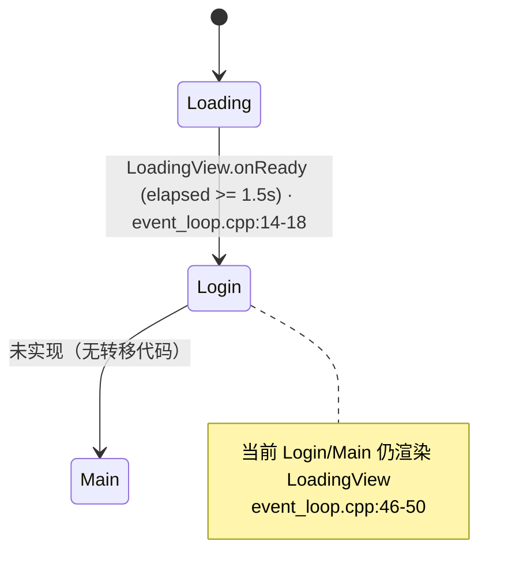
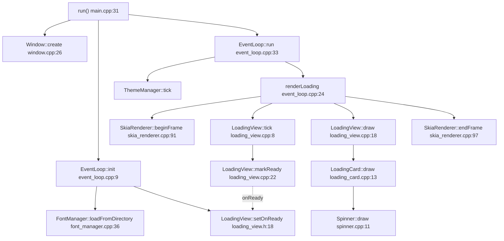

# 客户端 · App 与 UI 层

本页覆盖 `src/app`（进程入口、窗口、事件循环）与 `src/ui`（视图、动画、渲染），描述 `AppPhase` 状态机、
`EventLoop` 如何驱动视图、Skia 渲染 + 动画管线，以及 UI 如何把用户操作回调进 App 层。

!!! note "实现进度：当前处于 Phase 1"
    代码中大量注释标注了分阶段计划（`Phase 1` / `Phase 2` / `Phase 7`）。**当前主循环只驱动 `LoadingView`**，
    登录页与主界面虽已有类型声明，但尚未接入事件循环（见下文「已声明但未接线」一节）。本页如实记录当前行为，
    并明确标注哪些是脚手架。端到端视角见 [端到端数据流](../architecture/data-flow.md)。

## 目的与分层

- `src/app`：与操作系统 / GLFW / Skia GL 上下文打交道的最外层。持有窗口、渲染器、事件循环，是唯一的 `main` 入口。
- `src/ui/render`：`SkiaRenderer`（SkCanvas 的高层封装）+ `FontManager`（字体加载与文本绘制）。业务层只通过 `SkiaRenderer` 绘制，禁止直接碰 `SkCanvas`（`skia_renderer.h:4-5`）。
- `src/ui/anim`：补间动画基础设施（`Tween` / `AnimatedProperty` / `Sequence` / `Animator` / 缓动曲线 `curves`）。
- `src/ui/theme`：`ThemeManager` 全局单例调色板 + 缓动常量。
- `src/ui/views` + `src/ui/components`：具体视图与可复用组件。

## 进程入口

`wWinMain`（GUI 子系统）与 `main`（Debug console）都转发到 `run()`（`main.cpp:64-69`）。`run()` 顺序为（`main.cpp:31-60`）：

1. `initLogging()`：spdlog 控制台 + 轮转文件 `launcher.log`（2MB×4），`NDEBUG` 下 info、否则 debug（`main.cpp:16-29`）。
2. `ThemeManager::instance().setMode(Mode::System)`（`main.cpp:35`）。
3. 构造 `Window` + `WindowConfig{200×200, decorated=false}` 并 `window.create(cfg)`（`main.cpp:37-48`）。
4. `EventLoop loop; loop.init(window)`（`main.cpp:50-54`）。
5. `loop.run(window)` 阻塞直到窗口关闭（`main.cpp:56`）。

启动窗口刻意是 200×200 无边框（`main.cpp:40-42`），对应加载卡片尺寸。注释表明 Phase 2 计划切到 1100×720 主窗（`window.h:5`, `event_loop.cpp:17`），但该切换尚未实现。

## 窗口 + GL 上下文（`app/window.*`）

`Window::create`（`window.cpp:26-73`）：

- `glfwInit`，设置窗口 hint：`GLFW_DECORATED` 由 `cfg.decorated` 决定、`GLFW_RESIZABLE=TRUE`、请求 GL 3.3 Core、`GLFW_SAMPLES=0`（"Skia 自己管 AA"，`window.cpp:40`）、`GLFW_STENCIL_BITS=8`（`window.cpp:32-41`）。
- 创建窗口，设 user pointer，注册 framebuffer resize 回调 `s_onFramebufferResize`，`makeContextCurrent`，`glfwSwapInterval(1)` 开 vsync（`window.cpp:43-52`）。
- 读取 framebuffer 尺寸与 content scale 存 `m_dpi`（`window.cpp:54-58`）。
- `m_renderer.init(m_fb_w, m_fb_h)`（`window.cpp:60-62`）。
- Win11 特化：取原生 HWND 调 `DwmSetWindowAttribute(DWMWA_WINDOW_CORNER_PREFERENCE, DWMWCP_ROUND)` 保留圆角（`window.cpp:64-70`）。

`s_onFramebufferResize` 更新缓存尺寸并调 `m_renderer.resize`（`window.cpp:18-24`）。`Window` 还声明了 `HitTestFn` 回调用于 Phase 2 自绘标题栏拖拽，但目前只有 setter、无调用点（`window.h:44-45,50`）。析构自动 `destroy()`（`window.cpp:16,75-82`）。

## AppPhase 状态机

`AppPhase` 定义三态（`event_loop.h:10-14`）：

```cpp
enum class AppPhase : u8 { Loading = 0, Login = 1, Main = 2 };
```

`EventLoop` 私有成员：`m_phase{Loading}`、一个 `FontManager m_fonts`、一个 `LoadingView m_loading`、`m_last_time`（`event_loop.h:24-27`）。**注意 `EventLoop` 目前只内嵌 `LoadingView`，没有持有 `LoginView` / `ViewRouter` / 其它视图。**

`EventLoop::init`（`event_loop.cpp:9-22`）：

- 从 `assets/fonts` 加载字体，失败仅告警继续用系统兜底（`event_loop.cpp:10-13`）。
- 注册 `m_loading.setOnReady(...)`：回调里把 `m_phase = AppPhase::Login` 并打日志 `"Loading -> Login"`（`event_loop.cpp:14-18`）。这是**唯一实际发生的状态转移**。
- 记录起始时间（`event_loop.cpp:19`）。

主循环 `EventLoop::run`（`event_loop.cpp:33-54`）：

- 计算 `dt`，并 clamp 到 0.1s 上限避免卡顿后跳变（`event_loop.cpp:35-38`）。
- `win.pollEvents()`（`event_loop.cpp:40`）。
- 每帧 `ThemeManager::instance().tick(dt)` 推进主题切换插值（`event_loop.cpp:42`）。
- `switch(m_phase)`：`Loading` 调 `renderLoading`；**`Login` 与 `Main` 目前也 fallthrough 到 `renderLoading`**——注释明说「Phase 1 暂时停在 loading 视图，但 phase 已切换可在日志看到」（`event_loop.cpp:44-51`）。
- `win.swapBuffers()`（`event_loop.cpp:52`）。

`renderLoading`（`event_loop.cpp:24-31`）：取调色板 → `r.beginFrame(pal.bg)` → `m_loading.tick(dt)` → `m_loading.draw(r, m_fonts)` → `r.endFrame()`。



## EventLoop 如何驱动视图（当前实际路径）



`LoadingView`（`loading_view.*`）组合 `LoadingCard` + `LoadingCardState`（`loading_view.h:29-30`）。`tick` 累加 `m_elapsed`，用 `theme::clamp01(m_elapsed/0.18f)` 算 `fade_in`，推进卡片，并在 `m_elapsed >= kFakeDelaySec (1.5f)` 时调 `markReady()`（`loading_view.cpp:8-16`，`loading_view.h:36`）。`markReady` 幂等，触发 `m_on_ready`（`loading_view.cpp:22-26`）。

!!! note "加载是假延时，非真实心跳"
    头文件注释说 LoadingView 应在「后端心跳成功 + 本地存储就绪」后触发 onReady（`loading_view.h:3-4`），但当前用
    固定 `kFakeDelaySec = 1.5f` 模拟，标注 Phase 7 才接真实心跳（`loading_view.h:35-36`）。`m_state.fade_in` 已算出
    但绘制端并未消费它。真实心跳依赖 [网络层](net-storage-core.md#http) 接线，目前 `unverified`。

## 渲染管线（Skia GL Ganesh）

`SkiaRenderer` 用 pImpl 藏 Skia 类型（`skia_renderer.h:56-58`；`Impl` 持 `GrGLInterface` / `GrDirectContext` / `SkSurface`，`skia_renderer.cpp:26-30`）。

- `init`：`GrGLMakeNativeInterface` → `GrDirectContexts::MakeGL` → `resize`（`skia_renderer.cpp:39-52`）。
- `resize`：构造指向默认 FBO（`fFBOID=0`）、`GL_RGBA8`（`0x8058`）的 `GrGLFramebufferInfo`，`MakeGL` 后端渲染目标（sample=1, stencil=8），`SkSurfaces::WrapBackendRenderTarget`（`kBottomLeft_GrSurfaceOrigin`, `kRGBA_8888`），缓存 `m_canvas`（`skia_renderer.cpp:54-79`）。
- `beginFrame(clear_color)`：`m_canvas->clear(...)` 返回 canvas（`skia_renderer.cpp:91-95`）。`endFrame`：`gr_ctx->flushAndSubmit()`（`skia_renderer.cpp:97-101`）——注意 GLFW `swapBuffers` 不在这里，由 `EventLoop::run` 调用（`event_loop.cpp:52`）。
- 高层绘制原语：`drawRoundRect`（可选 `ShadowSpec`，用 `SkImageFilters::Blur` 在偏移图层画阴影再画主体，`skia_renderer.cpp:103-123`）、`drawCircle`（`125-131`）、`drawArc`（stroke + round cap，用于 spinner，`133-144`）、`drawText`（转发给 `FontManager::drawShapedText`，`146-150`）。
- 颜色经 `to_sk` 从 `theme::Color::toSkColor()` 转换（`skia_renderer.cpp:35-37`）。
- `shutdown`：reset surface、`abandonContext`、reset context/interface，防止 GL 资源泄漏（`skia_renderer.cpp:81-89`），析构里再次调用（`skia_renderer.cpp:33`）。

### 字体（`ui/render/font_manager.*`）

`FontManager` pImpl 持四个 typeface：primary=Space Grotesk、jp=BIZ UDPGothic、cn=Source Han Sans CN、mono=DejaVu Mono（`font_manager.cpp:18-24`）。`loadFromDirectory` 用 `SkFontMgr_New_Custom_Directory` 建 mgr 并 `matchFamilyStyle` 逐个匹配；primary 与 cn 都缺失才返回错误（`font_manager.cpp:36-52`）。

!!! warning "文本 shaping 未按声明实现"
    头文件明确要求「中日文必须经 SkShaper + HarfBuzz，禁止 `SkFont::drawText`」（`font_manager.h:3-5`）。但当前
    `drawShapedText` 直接用 `SkFont` + `canvas->drawSimpleText`，注释自承「Phase 1 只画 ASCII……后续中日文再接
    SkShaper」（`font_manager.cpp:54-73`）。虽然 `skshaper` 头已 include（`font_manager.cpp:11`），实际未调用。中日文
    混排会退化。`measureWidth` 同样只用 primary/cn 单一字体测量（`font_manager.cpp:75-80`）。

## 动画管线（`ui/anim`）

四层，互相独立、无一被 `LoadingView` 之外的活跃视图使用：

- **`curves`**（`curve.h`）：纯函数缓动库，`using Curve = f32(*)(f32)`（`curve.h:13`）。主曲线 `easeOutQuint`（对齐 `cubic-bezier(0.16,1,0.3,1)`，`curve.h:19-23`），另有 cubic/expo/back/elastic/spring/quad 等。时长常量 `kDurFast/Default/Slow/Big`（`curve.h:69-72`）。
- **`Tween<T>`**（`tween.h`）：单段插值，链式 `from/to/over/curve/delay/onDone`。`tick` 累加 `m_elapsed`（负值表示还在 delay），到时置 `done` 并回调；`value()` 用 `lerp<T>(from, to, curve(t))`（`tween.h:37-54`）。
- **`AnimatedProperty<T>`**（`animated_property.h`）：组件持有的自动属性。`animateTo(target, dur, curve, delay)` 内部建 `Tween` 并 `start`；`tick` 推进并在完成后 `reset`；有隐式 `operator T()` 便于读值（`animated_property.h:25-46`）。`duration<=0` 直接 `set`（`animated_property.h:27`）。
- **`Sequence`**（`sequence.h`）：`Tween<f32>` 串行编排，`then(...)` 累加步骤，逐个 `start`/`done` 推进，全部完成回调 `onComplete`（`sequence.h:29-48`）。
- **`Animator`**（`animator.*`）：单例，`schedule(Tickable)` 注册 `std::function<bool(f32)>`，`tick` 用 swap-pop 边遍历边删返回 false 的项（`animator.cpp:5-22`）。文档说用于 toast / view 切换等「游离」动画（`animator.h:3-5`）。

`lerp<T>`（`lerp.h`）特化了 f32/f64/i32/`theme::Color`（逐通道混合）/`Vec2`（`lerp.h:14-40`）。

!!! note "两套重复的缓动定义"
    `ui/anim/curve.h` 与 `ui/theme/animation.h` 各自定义了 `easeOutQuint`/`easeOutCubic`/`easeInOutCubic`。`LoadingView`
    走的是 theme 版的 `clamp01`（`loading_view.cpp:4,10`），动画基础设施走 `anim::curves`。二者内容重叠，属未收敛的历史遗留。

## 主题（`ui/theme`）

`ThemeManager` 单例（`theme_manager.h:22-44`）：`Mode{System,Light,Dark}`，`setMode`、`resolved()`（把 System 解析成 light/dark）、`palette()` 返回 `PaletteSnapshot`、`tick(dt)` 推进 `m_transition` 主题切换插值（`theme_manager.h:26-35`）。`PaletteSnapshot` 含 bg/card/divider/primary(+hover)/text_primary/text_muted/shadow(+hover)/close_hover（`theme_manager.h:14-20`），被 `event_loop.cpp:26`（bg）与 `loading_card.cpp:15,21-35`（card/shadow_hover/primary/text_muted）消费。（`theme_manager.cpp` 未在本次通读范围内展开，仅从头文件与调用点确认接口。）

## 组件

- **`LoadingCard`**（`loading_card.*`）：在 200×200 窗内画 168×168 居中卡片（圆角 `kRadiusMd` + 阴影），中央偏上放半径 22 的 spinner，下方居中画 caption（`loading_card.cpp:13-37`）。持有一个 `Spinner`（`loading_card.h:25`）。
- **`Spinner`**（`spinner.*`）：**逐帧旋转弧**而非补间——`tick` 按 `kRotPerSec=320°/s` 累加角度并 wrap，`draw` 调 `drawArc` 画 `kSweepDeg=80°` 的弧（`spinner.cpp:6-14`，`spinner.h:20-23`）。注释解释：加载需持续转到外部通知完成，故用 angle 累计而非 Tween（`spinner.h:4-6`）。

其余 `components/`（avatar, bubble, menu_item, pager, picker, popover, sidebar, topbar）仅有头文件，未在当前活跃路径接入。

## UI → App 的动作回调契约

回调都用 `std::function`，由外层（`EventLoop` 或未来的 App 协调器）注入、由 view/组件在事件发生时触发。当前**只有一条回调链真正接通**：

| 回调 | 声明 | 注入点 | 触发点 | 状态 |
|---|---|---|---|---|
| `LoadingView::OnReadyFn` | `loading_view.h:16-18` | `event_loop.cpp:14`（切 phase 到 Login） | `loading_view.cpp:24`（markReady） | 已接通 |
| `LoginView::OnSubmitFn` | `login_view.h:21-23` | 无 | 无 | **未接线** |
| `Window::HitTestFn` | `window.h:44-45` | 仅 setter | 无 | **未接线** |
| `Animator::Tickable` | `animator.h:13` | `schedule` | `tick` | 基础设施就绪，无业务调用方 |

`LoginView` 已声明完整交互面：`setOnSubmit`/`setError`、`onEnter`/`tick`/`draw`、`onMouseMove`/`onClick`/`onChar`/`onKeyDown`，内部有 `LoginCredentials{username,password,remember}`、`m_focus`（0=username,1=password）、以及 `m_opacity`/`m_card_y` 两个入场动画属性（`login_view.h:19-42`）。**但除 `loading_view.cpp` 外，`views/` 下没有任何 view 的 .cpp 实现文件**——这些方法尚未定义，也未被 `EventLoop` 实例化。

## 已声明但未接线的脚手架（重要）

`glob src/**/*.cpp` 显示 `views/` 目录下**只有 `loading_view.cpp`**。以下均为纯头文件声明，无实现、且未被主循环使用：

- **视图**：`login_view.h`、`home_view.h`（含 `UserSummary` 数据结构：name/email/tier_key/device_id_short/subscription_expires_human/last_login_human/online，`home_view.h:13-21`）、`chat_view.h`、`cloud_view.h`、`library_view.h`、`market_view.h`、`settings_view.h`。
- **`View` 基类**（`view.h`）：定义 `onEnter/onExit/tick/draw` + 鼠标 `onMouseMove/onClick`，`draw` 接收 `Rect area`（`view.h:15-28`）。这是未来多视图的统一契约，但 `LoadingView` **并未继承 `View`**（它是独立类，`loading_view.h:14`），说明基类是为 Phase 2+ 的路由视图准备的。
- **`ViewRouter`**（`view_router.h`）：定义 `RouteId{Loading,Login,Home,Library,Cloud,Settings}`（注意与 `AppPhase` 是**两套不同枚举**），`registerView`/`navigateTo`，内部有 fade-out→fade-in 切换状态机（`Idle/FadingOut/FadingIn` + `m_alpha`）（`view_router.h:15-41`）。**`EventLoop` 完全没有引用 `ViewRouter`**——当前 phase 切换靠 `EventLoop::m_phase` 的 switch，而非路由器。

!!! warning "两套并存的导航抽象尚未统一"
    App 层用 `AppPhase`（3 态，`event_loop.h:10`）驱动，UI 层预备了 `ViewRouter` + `RouteId`（6 态，`view_router.h:15`）+
    `View` 基类。两者目前没有连接：`EventLoop` 既不持有 `ViewRouter`，各业务 view 也未实现。要走到 Phase 2（登录页、
    主界面、窗口放大到 1100×720），需要把 `EventLoop` 改为持有 `ViewRouter`、让各 view 继承 `View` 并实现、并在
    `onReady`/登录成功处调 `navigateTo`。这是当前架构最大的未完成缝隙。

## 关键文件索引

- 入口/循环：`src/app/main.cpp`、`src/app/event_loop.{h,cpp}`、`src/app/window.{h,cpp}`、`src/app/common.h`（`Status`/`Result`/整数别名/禁拷贝宏；注明禁用异常+RTTI 用错误码，`common.h:26-48`）
- 渲染：`src/ui/render/skia_renderer.{h,cpp}`、`src/ui/render/font_manager.{h,cpp}`
- 动画：`src/ui/anim/{curve,lerp,tween,animated_property,sequence}.h`、`src/ui/anim/animator.{h,cpp}`
- 主题：`src/ui/theme/{theme_manager.h,color_tokens.h,animation.h}`
- 视图/组件：`src/ui/views/*.h`（仅 `loading_view.cpp` 有实现）、`src/ui/components/{loading_card,spinner}.{h,cpp}`（其余组件仅头文件）
