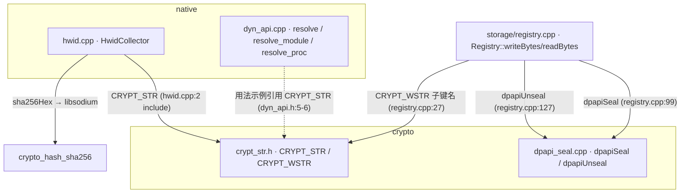

# 客户端 · 加密与原生模块

本页覆盖客户端**安全底座**的四个源文件，它们被 `storage/registry.cpp` 消费，服务于 HWID 绑定与本地密钥封存
两条链路。密码学的端到端视角见 [安全与信任模型 · 加密与验证链](../security/crypto-chain.md)。

| 模块 | 文件 | 职责 |
|---|---|---|
| 字符串混淆 | `src/crypto/crypt_str.h` | 编译期 XOR 混淆敏感字面量（API 名、注册表路径、URL），运行时按需解密 |
| DPAPI 封存 | `src/crypto/dpapi_seal.{h,cpp}` | 用 Windows DPAPI 把本地存储的密钥/令牌绑定到当前用户 |
| 硬件指纹 | `src/native/hwid.{h,cpp}` | 采集 14 项硬件特征 → SHA-256 指纹，用于反账号共享/多机滥用 |
| 动态导入 | `src/native/dyn_api.{h,cpp}` | 运行时解析 Win32 API，规避静态 IAT 扫描 |

## 2. 调用图

!!! note "客户端网络侧尚未接线"
    `HwidCollector::collectFingerprint()` 与后端 `/api/hwid/rebind/request`（`hwid.h:14-16` 注释、`RebindRequest`
    结构 `hwid.h:88-93`）在当前 `src/` 内**无 net/app 调用点**。全仓库搜索 `collectFingerprint`/`hwid_hex` 仅命中
    `native/` 与 `storage/registry.*`。指纹上报链路在客户端侧属**未接线（unverified）**；后端接收侧确实存在（见 §5）。

## 3. crypt_str —— 编译期字符串混淆 {#3}

### 算法（`crypt_str.h:16-45`）

- 种子常量 `kCryptStrSeed = 0x5A`（`crypt_str.h:16`）。
- 逐字节密钥派生：`derive_key(i,n) = 0x5A ^ ((i*0x9E)&0xFF) ^ ((n*0x37)&0xFF)`（`crypt_str.h:18-23`）。同时混入**下标 `i` 和长度 `n`**，作者注释目的是让相同前缀不同长度的字符串密文不一致、抗字符串聚类（`crypt_str.h:19`）。
- `CipherText<N>` 是 `constexpr` 构造，在编译期把明文逐字节 XOR 成密文数组，进入 `.rdata`（`crypt_str.h:25-33, 49`）。
- `decrypt()` 解到**栈缓冲** `buf[N]`，构造 `std::string` 后立即 `std::memset(buf,0,N)` 擦栈以减少明文滞留（`crypt_str.h:37-45`）。

### 宏（`crypt_str.h:50-59`）

- `CRYPT_STR(literal)`：lambda + `static constexpr CipherText` 保证明文永不静态出现，返回 `std::string`。
- `CRYPT_WSTR(literal)`：先 `CRYPT_STR` 再逐字节拓宽为 `std::wstring`（注意是简单 `begin/end` 拓宽，非 `MultiByteToWideChar`，头注释 `crypt_str.h:55` 的说法与实现 `:57-58` 不符——**仅适用于 ASCII 字面量**）。

存在理由（VMProtect 语境，`crypt_str.h:5-6`）：加壳前把显眼的 API 名、注册表路径、URL 干掉，运行时按需解密、无静态全字符表。上限 256、窄字符串、不放二进制（`crypt_str.h:8`）。

!!! warning "限制：这是抗静态扫描手段，不是保密手段"
    仅 XOR + 编译期常量密钥，无运行期熵。密钥完全由 `(i,n,0x5A,0x9E,0x37)` 决定，攻击者拿到二进制即可离线还原
    任意密文。`crypt_str.cpp` 仅有防链接器裁剪的 `kAnchor` 占位（`crypt_str.cpp:6-9`），注释预留了未来与
    `IsDebuggerPresent` 联动派生密钥（`crypt_str.cpp:4`）——**当前未实现**。

## 4. dpapi_seal —— 本地密钥封存 {#4}

### 实现（`dpapi_seal.cpp:19-54`）

- `dpapiSeal`：`CryptProtectData`，flag `CRYPTPROTECT_UI_FORBIDDEN`，可选 `entropy`（空则传 `nullptr`）。成功返回密文 vector 并 `LocalFree`（`:24-34`）。
- `dpapiUnseal`：`CryptUnprotectData`，解密后对系统返回缓冲 `SecureZeroMemory` 再 `LocalFree`（`:51-52`），解密侧比封存侧多一步擦零。
- 错误路径把 `GetLastError()` 塞进 `Result::error_code`（`:30, :48`）。

### 保护的对象

经 `registry.cpp` 封存的是 **8 个注册表 slot** 的内容（`registry.cpp:31-63` 的 `kLocs`，`Slot` 枚举顺序）：`UsernameHash / PasswordToken / SessionToken / HwidBinding / LastLoginUtc / SubscriptionTier / SubscriptionExp / DeviceSeed`。写入统一走 `writeBytes → dpapiSeal`（`registry.cpp:99`），读取走 `readBytes → dpapiUnseal`（`registry.cpp:127`）。slot 隐写布局详见 [网络/存储/核心 §2.1](net-storage-core.md#21-registry-dpapi)。

!!! note "user-bound 而非 machine-bound"
    头注（`dpapi_seal.h:3-4`）：注册表被 dump 走也无法在另一台机器解密。`dpapiSeal` 默认调用**未传 entropy**
    （`registry.cpp:99` 只传 `bytes`），头文件建议「传 HWID 派生值进一步绑机器」（`dpapi_seal.h:11`）**当前未启用**——
    因此仅绑当前用户 profile，未额外绑机器。

## 5. hwid —— 严格硬件指纹 {#hwid}

### 采集的 14 项（`hwid.h:30-46` 枚举 + `hwid.cpp:265-287` 采集）

| Part | 来源 API / 查询 | 代码位置 |
|---|---|---|
| BaseBoardSerial | WMI `Win32_BaseBoard.SerialNumber` | `hwid.cpp:267` |
| BiosUuid | WMI `Win32_ComputerSystemProduct.UUID` | `:268` |
| BiosVersion | WMI `Win32_BIOS.SMBIOSBIOSVersion` | `:269` |
| SmbiosSystemUuid | WMI `Win32_ComputerSystemProduct.IdentifyingNumber` | `:270` |
| GpuPnpId | WMI `Win32_VideoController.PNPDeviceID` | `:271` |
| GpuVendor | WMI `Win32_VideoController.AdapterCompatibility` | `:272` |
| CpuSignature | `__cpuid` brand string + leaf1 EAX/EBX/ECX/EDX | `:125-138, 274` |
| VolumeSerial | `GetVolumeInformationW("C:\")` 卷序列号 | `:119-123, 275` |
| SystemDiskSerial | `IOCTL_STORAGE_QUERY_PROPERTY` on `\\.\PhysicalDrive0` | `:220-241, 276` |
| MachineGuid | 注册表 `HKLM\SOFTWARE\Microsoft\Cryptography\MachineGuid`（`KEY_WOW64_64KEY`） | `:108-117, 277` |
| TpmEkPub | TBS `Tbsi_GetDeviceInfo`（见告警） | `:178-198, 278` |
| DisplayEdidHash | SetupAPI 枚举 `GUID_DEVCLASS_MONITOR` 读 `EDID` 值后 SHA-256 | `:200-218, 279` |
| PrimaryMacPhys | `GetAdaptersAddresses` 排序后首个物理 MAC | `:141-168, 283` |
| AllMacsHash | 所有物理 MAC 拼接后 SHA-256 | `:284-286` |

WMI 通过单例 `WmiSession`（`ROOT\CIMV2`，`hwid.cpp:49-79`）执行 WQL 查询。MAC 采集排除 loopback、非以太/非 802.11、`Description` 含 `Virtual`/`VPN` 的适配器（`:154-160`），并排序保证稳定性（`:167`）。

### 哈希方式（`hwid.cpp:171-176, 303-316`）

- `sha256Hex` 用 **libsodium `crypto_hash_sha256`**，`toHex` 输出小写 hex（`:42-46, 171-176`）。
- `collectFingerprint`：按 `HwidPart` 枚举**固定顺序**拼接 `partName + \x1F + value + \x1E`（分隔符选不出现在 hex/utf8 文本中的 `\x1F`/`\x1E`，`:307-314`），再 `sha256Hex(blob)`。

### 严格度门槛（`hwid.h:63-84, hwid.cpp:289-301`）

- `kMinPartsForTrust = 8`：填充项少于 8 视为不可信。
- `kCorePartsRequired = 4`：`SystemDiskSerial / MachineGuid / BaseBoardSerial / BiosUuid` 四个 core 缺任一即拒（`hwid.h:79-84`，`hwid.cpp:291-299`）。
- 未达标返回 `error_code=1` 并 `spdlog::warn`（`:296-299`）。
- `diff()`（`:318-325`）逐项比对两份 parts，供重绑定审核 UI 展示变化项。

### 后端二次盐化（跨栈）

客户端上报的 `hwid_hex` 到后端后由 `salt_hwid(hwid_hex, b"launcher.hwid.salt.v1")` 再做一次 `SHA256(server_salt || hwid_hex)`（`SystemBackend/crates/shared/src/hashing.rs:22-28`），落库前不存明文 HWID。调用点：`auth.rs:142`（注册/绑定）、`auth.rs:341-350`（登录比对）、`heartbeat.rs:40`。用户名走同源函数不同盐 `launcher.user.salt.v1`（`auth.rs:66`）。详见 [后端 · 认证/会话 §2](../backend/auth-session.md) 与 [加密链 §2](../security/crypto-chain.md)。

!!! warning "TpmEkPub 是占位实现，非真实 EK"
    `hwid.h:42` 与 `hwid.h:12` 声称「TPM 重置 → EK 变 → fail」，但 `queryTpmEkPub`（`hwid.cpp:180-197`）**只取
    `TPM_DEVICE_INFO`（版本/厂商/接口类型）**，注释自认「取真 EK 较繁琐，占位为 device version，后续可扩展」
    （`:180-181`）。因此 TPM clear **不会**改变此值——与头部设计目标不符。

!!! warning "「任意一项改变即 fail」的设计目标与实现有出入"
    `hwid.h:5-12` 声称任一硬件变更都令指纹变化，但：TpmEkPub/DisplayEdidHash 等**非 core** 项允许缺失（阈值只要
    8 项 + 4 个 core），换显示器/无 TPM 机器仍可能过阈值。实际语义是「core 四项必须齐全且总填充≥8」，而非
    「逐项锁定」。

!!! danger "关联审计发现：HWID 未在后端强制"
    项目已知 HWID 未在后端强制执行（登录路径接受 HWID 但不因不匹配拒绝，仅回 `hwid_ok` 标志）。本页只描述客户端
    采集行为；后端 advisory 语义与该 High 级审计项见 [后端 · 认证/会话 §5](../backend/auth-session.md#5)、
    [安全与信任模型](../security/index.md#hwid) 与 [加密链 §2.3](../security/crypto-chain.md)。

!!! warning "出货客户端用的是简化 HWID，不是 14 源版本"
    实际可运行的 D2D 客户端 `tools/preview-d2d/hwid.h:15-54` 只用 `ComputerName + UserName + 系统盘 VolumeSerial`
    经 Windows CryptoAPI SHA-256 得 64 hex。`src/native/hwid` 的 14 源严格实现**尚未接入主交付路径**，简化指纹极易伪造
    （改机器名 + 卷序列号即可），强度远低于设计目标。

## 6. dyn_api —— 动态导入隐藏 {#6}

### 实现（`dyn_api.cpp:8-22`）

- `resolve_module`：先 `GetModuleHandleA`，未加载再 `LoadLibraryA`；**不缓存 handle**，作者注释目的是避免反作弊扫到稳定的 handle 表（`dyn_api.cpp:8`）。
- `resolve_proc`：`GetProcAddress`。
- `resolve<Fn>` 模板（`dyn_api.h:16-21`）：组合上二者并 `reinterpret_cast` 成目标函数指针。

存在理由（头注 `dyn_api.h:3-6`）：避开静态 IAT，让加壳后扫描更难。典型用法配合 `CRYPT_STR` 把 DLL 名与 API 名也混淆：`resolve<...>(CRYPT_STR("kernel32.dll"), CRYPT_STR("CreateProcessW"))`（`dyn_api.h:5-6`）。

!!! warning "IAT 隐藏当前无实际调用点"
    全仓库未见 `native::resolve(` 的调用者（仅头文件用法示例）。这是抗**静态** IAT 分析，不抗运行期 hook——
    API 名仍通过明文 `GetProcAddress` 传入。它是 [端到端数据流 · 启动游戏](../architecture/data-flow.md#4) 中唯一存在的
    相关构件，但启动路径整体未落地。

## 7. 关键数据结构

- `Result<T>`（`app/common.h:28-32`）：`{ T value; int error_code; }`，`ok()` 即 `error_code==0`。贯穿 dpapi、hwid、registry 的错误传递。
- `Status`（`app/common.h:37`，`code==0` 为 ok）：registry 写入路径返回值。
- `HwidPart` / `HwidParts`（`hwid.h:30-61`）：枚举 + `unordered_map<HwidPart,string>`，`has/get/filledCount` 辅助。
- `RebindRequest`（`hwid.h:88-93`）：重绑定 payload 结构（`old/new fingerprint hex + new_parts + reason`），后端侧接收在 `SystemBackend/crates/api/src/rebind.rs`。

## 关键文件路径

- `src/crypto/crypt_str.h` / `crypt_str.cpp`
- `src/crypto/dpapi_seal.h` / `dpapi_seal.cpp`
- `src/native/hwid.h` / `hwid.cpp`
- `src/native/dyn_api.h` / `dyn_api.cpp`
- 主消费者：`src/storage/registry.cpp`（`kLocs` slot 布局 `:31-63`、seal/unseal `:99/:127`）
- 后端盐化：`SystemBackend/crates/shared/src/hashing.rs:22`；调用点 `auth.rs:142/341`、`heartbeat.rs:40`
