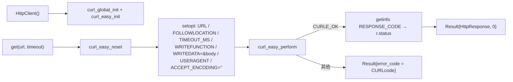
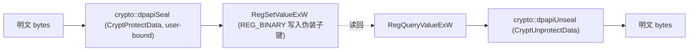
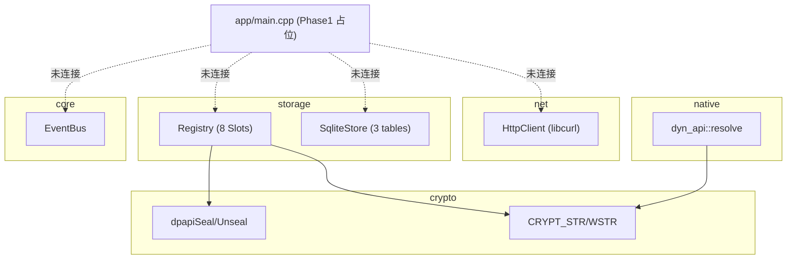

# 客户端 · 网络 / 存储 / 核心

本页覆盖客户端三个底层能力模块，均位于 `src/` 下：

- `src/net` —— libcurl 封装的 HTTP 客户端，客户端与后端通信的唯一出口。
- `src/storage` —— 两层本地持久化：注册表隐写层（敏感数据，DPAPI 封装）与 SQLite 缓存层（非敏感数据）。
- `src/core` —— 目前仅一个类型擦除事件总线 `EventBus`。

!!! warning "实现现状：这些是尚未接线的构件（unwired building blocks）"
    程序入口 `src/app/main.cpp` 仍是 Phase 1 占位实现：只初始化日志、开一个 200×200 无边框窗口并跑事件循环
    （`src/app/main.cpp:31-60`），**没有任何地方实例化 `HttpClient` / `Registry` / `SqliteStore`，也没有反序列化订阅或
    启动游戏**。全 `src/app` 内对这些类型的引用数为 0（已验证），且客户端源码里**不存在 `Launcher` 类**。
    因此下文「订阅缓存流」与「启动路径」中凡涉及跨模块编排的部分，是**各构件能力 + 契约**，而非已落地调用链，
    均标注 `unverified（未落地）`。端到端视角见 [端到端数据流](../architecture/data-flow.md)。

## 一、net：HTTP 客户端 {#http}

### 类型与接口

`launcher::net::HttpClient`（`src/net/http_client.h:16-26`）：

- `Result<HttpResponse> get(const std::string& url, int timeout_ms = 10'000)` —— **当前只暴露 GET**（头注释 `http_client.h:3-4` 明确写「当前只暴露 GET，POST/header/超时后续扩展」）。
- `HttpResponse { long status; std::vector<u8> body; }`（`http_client.h:11-14`）——响应体是原始字节，便于后续直接喂给 protobuf 反序列化。
- 用 `void* m_curl` 存 `CURL*`，刻意不在头里 `#include curl.h`（`http_client.h:25`）。禁拷贝（`http_client.h:20`）。

### 控制流

要点（`src/net/http_client.cpp`）：

- 构造函数做全局 `curl_global_init(CURL_GLOBAL_DEFAULT)` + `curl_easy_init`（`:15-18`）；析构做 `curl_easy_cleanup` + `curl_global_cleanup`（`:20-23`）。
- 每次 `get` 先 `curl_easy_reset`（`:28`），复用同一 easy handle。
- 写回调 `writeCb` 把响应体 append 进 `std::vector<u8>`（`:7-12`），通过 `CURLOPT_WRITEDATA` 绑定到 `r.body`（`:35`）。
- `CURLOPT_FOLLOWLOCATION=1`（`:32`）、`CURLOPT_ACCEPT_ENCODING=""`（`:37`，启用全部内置压缩）。User-Agent 固定 `"Launcher/0.1 (+windows)"`（`:36`）。
- 错误映射：`m_curl` 为空返回 `error_code=1`（`:26`）；`perform` 失败把 `CURLcode` 直接塞进 `error_code`（`:41`），与 `Status`/`Result` 的「0 即成功」约定一致（`src/app/common.h:27-33`）。

!!! warning "传输安全尚未落地"
    - 代码里**没有**设置 `CURLOPT_PINNEDPUBLICKEY`，证书 pinning 只是 `:39` 的一行 TODO 注释（Phase 7）。头注释 `:3` 也把 Ed25519 验签 + AES-GCM 标为 Phase 7 待办。
    - 未见任何 TLS 校验加固选项（`CURLOPT_SSL_VERIFYPEER/HOST` 保持 libcurl 默认）。
    - 生产后端按部署事实走 **HTTP（非 HTTPS）**，因此当前 GET 明文传输，pinning 无从谈起。这属已知传输层弱点，
      与 [加密链 §4.3](../security/crypto-chain.md) 和 [安全与信任模型](../security/index.md) 交叉引用。

## 二、storage：两层持久化

存储被刻意分成两层（`src/storage/sqlite_store.h:3-5` 注释明说）：**敏感数据走 `Registry`（DPAPI），非敏感数据走 `SqliteStore`**。

### 2.1 Registry —— 注册表隐写 + DPAPI 封装

#### Slot 模型

`enum class Slot : u8`（`src/storage/registry.h:21-30`）定义 8 个敏感槽位：

| Slot | 含义 |
|---|---|
| `UsernameHash` (0) | 用户名哈希 |
| `PasswordToken` (1) | 密码令牌 |
| `SessionToken` (2) | 会话令牌 |
| `HwidBinding` (3) | HWID 绑定 |
| `LastLoginUtc` (4) | 上次登录 UTC |
| `SubscriptionTier` (5) | 订阅等级 |
| `SubscriptionExp` (6) | 订阅到期 |
| `DeviceSeed` (7) | 随机 32B，注释说用作 AES-GCM 派生 key 的 salt（`registry.h:29`） |

接口（`registry.h:32-52`）：单例 `instance()`；`writeBytes/readBytes/erase`；字符串便捷版 `writeString/readString`；`wipeAll()`（强清理）；`sprinkleDecoys()`（灌假数据）。

#### 隐写布局

每个 slot 映射到一条独立的 HKCU 伪装路径 `SlotLoc`（`registry.cpp:18-23`），`kLocs[]` 表（`:31-63`）把 8 个 slot 分别藏进 Win11 上本就存在的系统/常用软件子键，例如：

- `UsernameHash` → IE `Internet Settings\ZoneMap\Cache`（`:33-34`）
- `PasswordToken` → Office `16.0\Common\Identity`（`:37-38`）
- `SessionToken` → Edge `PreferenceMACs`（`:41-42`）
- `HwidBinding` → Windows Search `PropertyCache\Volume0`（`:45-46`）
- 其余见 `:49-62`（Explorer StreamMRU / MediaPlayer / TextInputFramework / Shell BagMRU）

设计理由（`registry.h:11-14`, `registry.cpp:16-17`）：父键必须本就存在、平时被读不常写、避开 Run/RunOnce/Startup 等明显敏感位置；单键 1 真值 + 3~5 假值，扫描者需挖 8 个键。`static_assert`（`:64-65`）强制 `kLocs` 数量 == 8。值名是固定 GUID 风格字符串，fake siblings 用 `sibling_prefix` + 随机 16 位十六进制命名。

子键路径字符串**不以明文出现在二进制**：用 `SUBKEY(...)` 宏（`:26-29`）把字面量包成 lambda，内部 `CRYPT_WSTR(literal)` 在每次调用时才解密（编译期 XOR 混淆见 [加密与原生 §3](crypto-native.md#3)）。

#### 加密链

- `writeBytes`（`registry.cpp:98-110`）：先 `dpapiSeal`（`:99`），失败即返回；`openOrCreate` 用 `RegCreateKeyExW`（`:72-77`）拿句柄；`RegSetValueExW` 以 `REG_BINARY` 写 `value_name`（`:106-107`）。
- `readBytes`（`:112-128`）：`RegOpenKeyExW` → 两次 `RegQueryValueExW`（先取 size 再取数据），校验 `type==REG_BINARY && cb!=0`（`:120`），最后 `dpapiUnseal`（`:127`）。
- `erase`（`:130-138`）删单个值；`writeString/readString`（`:140-147`）是 bytes 的字符串包装。

!!! note "DPAPI 仅 user-bound，注释承诺的 AES-GCM 层未落地"
    封装用 `CryptProtectData` 绑定**当前用户**（`CRYPTPROTECT_UI_FORBIDDEN`），解封 `CryptUnprotectData` 后
    `SecureZeroMemory` 擦明文（`src/crypto/dpapi_seal.cpp`）。但 `Registry::writeBytes` 调 `dpapiSeal(bytes)`
    **未传 entropy**（`registry.cpp:99`），所以只做 user-bound、没做 machine-bound。`Slot::DeviceSeed` 注释里描述的
    「AES-GCM 二次加密（密钥=HWID 派生）」（`registry.h:8,29`）在实现中**未见落地**——属设计意图
    `unverified（未落地）`。详见 [加密与原生 §4](crypto-native.md#4) 与 [加密链 §5.2](../security/crypto-chain.md)。

#### wipeAll / sprinkleDecoys

- `sprinkleDecoys()`（`:170-179`）首启时给每个父键灌 `sibling_count` 个假值；`sprinkle`（`:80-92`）用 `mt19937_64` 生成 64 字节随机数据，已存在的名不覆盖（`:87`）。
- `wipeAll()`（`:149-168`）：删 8 个真值，再枚举每个父键 `RegEnumValueW`、删除以 `sibling_prefix` 开头的假值（删后 `--i` 回退索引，`:163`）。注释说卸载/退出登录时调用（`registry.h:43`）。

### 2.2 SqliteStore —— 非敏感缓存

`launcher::storage::SqliteStore`（`sqlite_store.h:12-27`）：`open/close/execute/raw()`，持 `sqlite3*`，禁拷贝。

`open`（`sqlite_store.cpp:11-44`）：`sqlite3_open_v2(READWRITE|CREATE)`（`:12-13`）；PRAGMA `journal_mode=WAL` / `synchronous=NORMAL` / `foreign_keys=ON`（`:18-20`）；bootstrap schema（`:23-42`）建三张表：

| 表 | 列 |
|---|---|
| `subscription_cache` | `id` PK / `name` / `updated_at` INTEGER / `payload` BLOB |
| `game_meta` | `game_id` PK / `sub_id` / `display_name` / `version` / `local_hash` BLOB / `last_played` |
| `ui_pref` | `key` PK / `value` |

`execute`（`:50-59`）用 `sqlite3_exec`，错误经 spdlog 记录并返回 `Status::Err(rc)`。

!!! note "schema 就位，但无读写调用"
    `subscription_cache` 字段 `id/name/updated_at` 对齐 proto `Subscription`（`src/proto/subscription.proto:10-12`），
    `payload BLOB` 用于存整个已签名 `.helix` 字节流，`game_meta.local_hash` 对应本地已下载文件的 BLAKE3。但
    **当前没有任何代码向这些表插入或查询数据**（除建表 SQL 本身）——缓存流是 schema 已就位、读写逻辑
    `unverified（未落地）`。proto 结构详见 [Signer / Proto §2](../data/signer-proto.md#2-proto)。

## 三、core：EventBus

`launcher::core::EventBus`（`src/core/event_bus/event_bus.h:18-50`）是 core/ 目录下**唯一**类型。

- 单例 `instance()`（`event_bus.cpp:4`）。
- 类型擦除：`subscribe<E>(fn)` 把回调包成 `void(const void*)` 存进 `unordered_map<type_index, vector<fn>>`（`:22-29`）；`publish<E>(e)` 按 `type_index` 找回调（`:31-41`）。
- 线程安全：`std::mutex m_mtx` 保护订阅表；`publish` 先在锁内拷贝一份 `snapshot` 再出锁调用（`:33-40`），避免回调里再操作总线时死锁。
- 设计意图（头注释 `:3-4`）：core 通过它单向通知 UI，UI 不反向持有 core 引用。示例事件 `SubscriptionUpdated`（`:6-7`）在代码中**未定义具体类型**，仅注释举例。

## 四、订阅协议与「启动路径」（契约层，多为未落地） {#4}

### 4.1 客户端唯一真实存在的相关构件

- **HTTP 传输能力**（`HttpClient::get`）。
- **动态解析 Win32 API 的机制** `native::dyn_api`（`src/native/dyn_api.h/.cpp`）：`resolve<Fn>(dll, proc)`（`dyn_api.h:16-21`）→ `resolve_module`（`GetModuleHandleA` 失败再 `LoadLibraryA`，刻意不缓存 handle 以避开反作弊扫描稳定 handle 表，`dyn_api.cpp:8-15`）→ `resolve_proc`（`GetProcAddress`）。头注释 `:4-6` 用法示例正是解析 `CreateProcessW`。详见 [加密与原生 §6](crypto-native.md#6)。

### 4.2 期望的启动路径 vs 实际

契约存在（`.proto` + signer 侧 BLAKE3/Ed25519 实现），但客户端侧的**反序列化、验签、BLAKE3 校验、进程创建全部未实现**：

- 客户端**没有** BLAKE3 实现或调用（全 `src/` 搜索仅命中 `.proto` 注释一处）。
- 客户端**没有**任何 `CreateProcessW` 实际调用（仅 `dyn_api.h:4-6` 注释示例）、没有 protobuf 反序列化、没有 Ed25519 验签。

完整的启动路径图与实现状态，见 [端到端数据流 · 启动游戏](../architecture/data-flow.md#4)；签名侧实现与信任含义见 [加密链 §4](../security/crypto-chain.md)。

## 五、跨模块依赖速览

已验证的真实依赖边：`Registry` → `crypto::dpapiSeal/Unseal`（`registry.cpp:2,99,127`）+ `CRYPT_WSTR`（`:33` 等）；`dyn_api` → `CRYPT_STR`（`dyn_api.h:9`）。`app` 层到 net/storage/core 的边**全部缺失**（已验证 `src/app` 无引用）。

## 关键结论

1. net/storage/core 三层是**功能完整但未接线的构件**；`main.cpp` 仍是 Phase 1 占位，项目里**没有 `Launcher` 类**。
2. `HttpClient` 只有 GET，明文 HTTP，无证书 pinning（TODO），无验签/AES-GCM。
3. `Registry` 的隐写 + DPAPI(user-bound) 真实落地；头注承诺的 AES-GCM 二次加密 / HWID 派生 entropy / machine-bound **未落地**。
4. `SqliteStore` 三张表 schema 就位，但无读写调用——订阅缓存流是设计而非实现。
5. 「下载→Ed25519 验签→BLAKE3 校验→`CreateProcessW`」启动路径：仅契约 + signer 侧实现 + 客户端 `dyn_api` 机制存在；客户端消费侧全部未实现。

## 关键文件索引

`src/net/http_client.{h,cpp}`、`src/storage/{registry,sqlite_store}.{h,cpp}`、`src/core/event_bus/event_bus.{h,cpp}`、`src/proto/subscription.proto`、`src/native/dyn_api.{h,cpp}`、`src/crypto/{dpapi_seal,crypt_str}.{h,cpp}`、`src/app/main.cpp`；签名侧对照 `SystemBackend/crates/signer/src/main.rs`。
