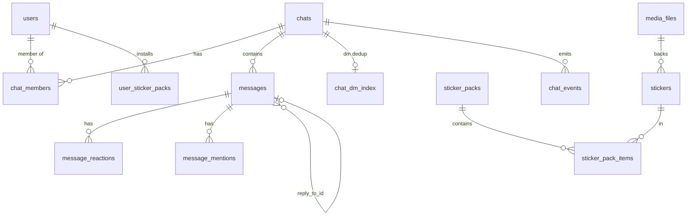

# 数据模型（PostgreSQL）

后端数据库由 `SystemBackend/migrations/0001..0019` 顺序演进而来，从 0001 的 7 张表扩展到覆盖身份/会话/订阅/
邀请/聊天/媒体/表情包/市场/角色/社区/论坛/工单/成长/后台配置的完整模型（0019 为媒体缩略图/BlurHash 列）。
`users` 是全库 CASCADE 枢纽。

## 约定

- snake_case、时间戳一律 `timestamptz`、金额/计数一律 `BIGINT`（`0001_init.sql:1-2`）。
- 多个迁移末尾有 `ALTER TABLE ... OWNER TO helix` / 按 db owner 改属主的兜底块（如 `0011:6-10`, `0012`, `0015:202-219`, `0017:66-74`），以适配 prod（`helix`）与 audit 双库；`0012_portable_table_owner.sql` 专门让属主随 `current_database()` 的 owner 走。

## 1. 核心身份与会话（0001, 0002, 0003）

`users` 被绝大多数表以 `ON DELETE CASCADE` 外键引用。初始列（`0001:6-16`）：`id`(UUID PK), `username_hash`(unique), `password_hash`(argon2id PHC), `hwid_bound`(服务端二次盐化后的 HWID), `subscription_tier`, `subscription_expires_at`, `created_at`, `last_login_at`, `note`。后续迁移累加：

- `0002`：`hwid_strict_required`（默认 TRUE）, `hwid_last_changed_at`
- `0003`：三段身份 —— `uid`(公开短 ID,不可改), `username`(登录用,不可改), `nickname`(可改,受频率限制), `nickname_changed_at`, 头像 `avatar_path/mime/updated_at`, `password_changed_at`
- `0004`：`invite_code_used`
- `0006`：`credit_balance`(BIGINT, 单位分)
- `0008`：`is_admin`(bool)
- `0009`：`role`(默认 'user'), `role_label`
- `0010`：`status`(online/busy/away/sleep/offline), `last_seen`
- `0011`：`status_text`, `bio`

!!! warning "HWID 相关字段 vs 实际强制"
    `users.hwid_strict_required` 默认 TRUE（`0002:25`），但项目已知审计结论是「HWID 未被强制」。schema 提供了字段，
    强制逻辑在 auth 层且当前是 advisory（见 [后端 · 认证/会话 §5](../backend/auth-session.md#5) 与 [安全与信任模型](../security/index.md#hwid)）。

- `sessions`（`0001:18-27`）：`token`(PK), `user_id`(FK CASCADE), `expires_at`, `created_at`, `user_agent`, `remote_ip`(INET)。会话生命周期见 [认证/会话 §6](../backend/auth-session.md)。
- `subscriptions`（`0001:29-38`）：`id`(TEXT PK), `user_id`(FK), `name`, `updated_at`, `expires_at`, `helix_blob`(BYTEA 回退副本), `issuer`。见 [Signer / Proto §3](signer-proto.md#3)。
- 其余：`audit_log`（`0001:40-48`）、`heartbeats`（`0001:51-56`）、`login_history`（`0003:32-46`）、`user_avatar_meta`（`0003:49-54`）、`rate_limits`（`0003:21-29`，播种 nickname_change/avatar_upload/password_change）。

## 2. 邀请码（0004）

`invite_codes`（PK `code`, `max_uses`/`use_count`, `expires_at`, `revoked_*`）+ 多用码展开表 `invite_code_uses`。播种一个 bootstrap 码 `LAUNCHER1`（`0004:44-46`）。注册时的并发防抢逻辑见 [认证/会话 §3](../backend/auth-session.md)。

## 3. 聊天 / 媒体 / 表情包（0005, 0007, 0008, 0013, 0014）

- `chats`（`0005:8-17`）：`kind`(dm/group/channel), `title`, `last_message_at`, `is_public`；`0007` 加 `slug`(唯一,官方频道稳定 key)/`is_official`/`group_label`(IMPORTANT/GENERAL/GAMES/SHOP)；`0008` 加 `write_role`(admin_only/user)。播种 8 个官方频道（`0007:14-24`）。
- `chat_dm_index`（`0005:21-27`）：DM 两个 user_id 排序后 unique，`CHECK(user_lo < user_hi)` 防重复。
- `chat_members`（`0005:30-38`）：PK(chat_id,user_id), `role`(member/admin/owner), `last_read_message_id`, `muted_until`。
- `messages`（`0005:51-62`）：`id`(BIGSERIAL), `msg_type`(text/image/video/gif/sticker/pack_share/system), `payload`(JSONB), `reply_to_id`(自引用), 软删 `deleted_at`。触发器 `trg_bump_chat`（`0005:138-146`）在插入时更新 `chats.last_message_at`。`0013` 加 `client_msg_id`+`sender_device_id` 做幂等发送（唯一索引 `ux_messages_client_msg`）。
- `media_files`（`0005:76-88`）：`sha256` 唯一（内容寻址去重）+ 尺寸/时长/相对路径。`0019` 追加两列（全 additive，`IF NOT EXISTS`）：`blurhash TEXT`（上传时算的 4×3 BlurHash 串，客户端画模糊占位）、`has_thumbs BOOLEAN NOT NULL DEFAULT FALSE`（是否已生成兄弟缩略图文件）。缩略图是**内容寻址派生**的兄弟文件 `<sha>_s<slot>.jpg|png`（档位 64/128/256/400/512，与原图同目录），读取端 `?s=<px>` 按档返回、缺失回退原图（见 [图片管线 §3](../client/image-pipeline.md)）。旧行 `blurhash=NULL`/`has_thumbs=false`，需一次性 backfill 任务补齐（`0019:13-24` 注释，迁移不自动执行）。
- 表情包链：`stickers` → `sticker_packs` → `sticker_pack_items`(M:N) → `user_sticker_packs`（安装）。
- `0013` 还加 `chat_events`(可回放事件流) 与 `user_client_settings`(PK user_id+scope+key, JSONB value)。
- `0014` 全局审核：`user_mutes`(全局禁言)、`message_mentions`。

## 4. 市场（0006） {#41}

`market_categories` → `market_listings`（`item_type` sticker_pack/config/save/theme/other, `item_ref_id` 指向具体表, `cover_media_id`→media_files）→ `market_orders`（状态机 pending/paid/delivered/refunded/cancelled）→ `market_reviews`(1-5 星, listing+reviewer 唯一)。`credit_ledger` 记 credit 流水（recharge/purchase/refund/admin_grant）。播种 5 个类目（`0006:83-89`）。授信管理端点见 [API 与管理后台 §3.1](../backend/api-admin.md)。

## 5. 角色 / 标签（0009）

`user_roles_catalog`（可自定义角色, 播种 admin/oldhand/newhand/user；`0014:32-35` 追加 owner/super_admin）+ `user_tags`(用户 chips)。

## 6. 社区 / 论坛 / 工单 / 成长体系（0015, 0016）

这是最大的一次迁移。新增：

- `community_areas`（区块 slug，播种 important/general/games/shop/tickets/forum，`0015:153-160`）。
- `channel_settings`（`0015:15-31`）：每频道写策略 `write_policy`(everyone/admin_only/role_only/min_level/readonly/locked/subscriber_only)、`min_level`(1-100)、`slowmode_seconds`(0-86400)、`requires_subscription` 等。从现有 `chats` 回填（`0015:168-196`）。
- `ticket_categories` + `tickets`（`0015:44-68`）：每工单绑一个专属 `chat_id`(unique)，`number`(BIGSERIAL), 状态 open/pending/resolved/closed, `visibility` private/public, 超管保护字段 `protected_by_superadmin`。播种 3 个内建类目（`0015:162-166`）。
- `forum_topics`（`0015:70-86`）：绑 chat_id，状态 open/locked/hidden/archived, `pinned`, `view_count`。
- `announcements`（`0015:88-104`）+ `0016` 的 `announcement_reads`(每用户已读/确认状态)。
- 成长：`user_progress`（level 1-100, xp, `last_checkin_at`）+ `user_xp_events`(流水)。为所有现有用户回填 `user_progress`（`0015:198-200`）。
- 审核：`message_admin_edits`（编辑/redact 前后 payload 存档）+ `chat_mutes`(按频道禁言，区别于 `0014` 的全局 `user_mutes`)。

## 7. 后台自定义 / 运营者（0017, 0018）

- `admin_operators`（`0017:3-15`）：`user_id`(unique, `ON DELETE SET NULL`), `username`(unique), `operator_role`(owner/admin/operator/auditor), `enabled`。operator 角色模型见 [API 与管理后台 §4](../backend/api-admin.md#4)。
- `app_config_entries`（`0017:19-36`）：DB 驱动的运营配置，`key` 有正则 CHECK，`value_type`(string/number/bool/json), `value`(JSONB), `expose_to_client` 控制是否下发客户端 bootstrap。播种 branding/features/limits/community 若干项（`0017:54-64`）。
- `app_config_revisions`（`0017:38-52`）：配置变更审计（old/new value + enabled + expose + actor）。
- `0018`：为 `admin_operators.user_id` 补 partial unique index（老部署 0017 已应用时的补丁），与 0017 fresh-install 的 `UNIQUE` 对齐。

## 关键发现小结

- `users` 是 CASCADE 枢纽，被绝大多数表引用。
- 多迁移末尾有 owner 兜底以适配 helix/audit 双库（`0012_portable_table_owner.sql`）。
- schema 覆盖完整业务域，但部分字段（如 `hwid_strict_required`、`subscriptions.helix_blob`）的强制/读取逻辑在应用层缺失或未落地，详见交叉引用的对应页与 [安全与信任模型](../security/index.md)。
