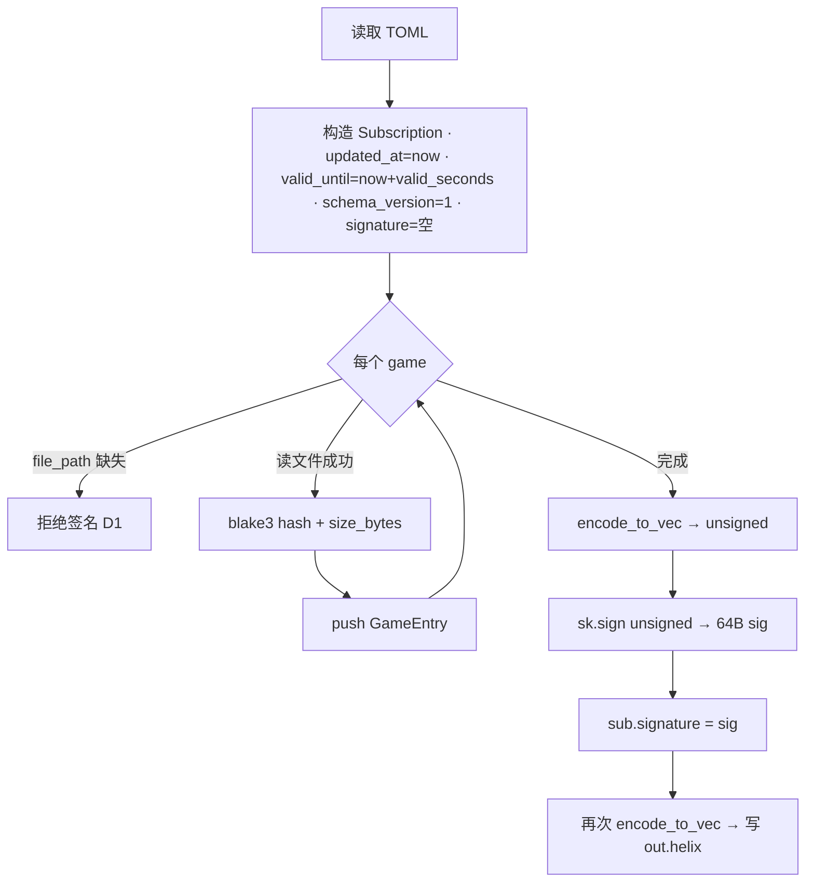
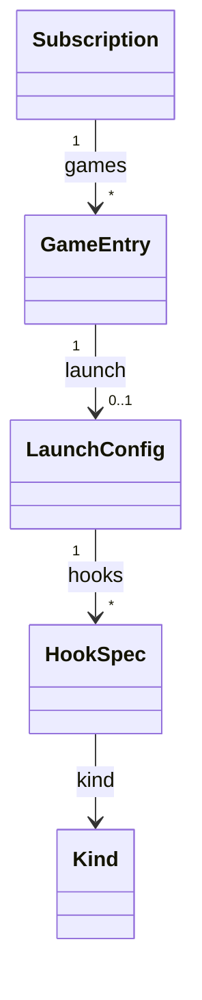

# Signer / .helix / Proto

本页描述离线 Ed25519 签名工具 `signer`、`.helix` 签名格式，以及跨仓共用的 protobuf 契约。它是 [端到端数据流 ·
订阅刷新 / 启动游戏](../architecture/data-flow.md) 与 [加密链 §4](../security/crypto-chain.md) 的详细参考。

## 1. Signer CLI 与 `.helix` 签名格式

### 1.1 目的与信任模型

离线 Ed25519 签名工具。私钥永不上服务器，签发在本地离线完成；服务端只持公钥用于展示/审计（`signer/src/main.rs:7`）。客户端内置公钥验签。三个子命令（`main.rs:24-44`, `68-75`）：

- `keygen --out <dir>` — 生成密钥对
- `sign --key <pri> --in <toml> --out <out.helix>`
- `verify --key <pub> --in <helix>`

### 1.2 `keygen`（`main.rs:77-87`）

`SigningKey::generate(&mut OsRng)` 生成 Ed25519 私钥，写出三份到 `<dir>`：`private.key`（原始 32 字节私钥 `sk.to_bytes()`，`main.rs:81`）、`public.key`（原始 32 字节公钥，`:82`）、`public.hex`（公钥 hex，`:83`，并 `println!` 到 stdout）。

!!! warning "私钥明文落盘"
    私钥以裸 32 字节明文写入 `signer/private.key`（`main.rs:81`），无口令加密。文件系统权限是唯一保护。

### 1.3 输入 TOML 结构

签名输入是 TOML，反序列化为 `SubscriptionToml`（`main.rs:59-66`），内嵌 `GameTomlEntry` 列表（`main.rs:46-57`）：

| TOML 字段 | 类型 | 说明 |
|---|---|---|
| `id` / `name` | String | 订阅 id / 名称 |
| `valid_seconds` | u64 | 有效期秒数（相对签发时刻） |
| `issuer` | String | 签发者（管理员邮箱，仅展示） |
| `games[]` | list | 见下 |

`GameTomlEntry`：`game_id`, `display_name`, `version`, `download_url`（必填）；`file_path`（可选，用于本地算 BLAKE3）；`cover_url`（可选）；`executable`（必填）；`args`, `working_directory`（可选）。

### 1.4 `sign` 流程（`main.rs:99-159`）

关键点：

- `updated_at = now`（`main.rs:104,109`），`valid_until = now + cfg.valid_seconds`（`:110`），`schema_version` 硬编码为 `1`（`:113`）。
- **空 file_hash 拒签（D1 修复）**：若某 game 只有 `download_url` 而无 `file_path`，直接 `bail`（`main.rs:121-127`）。理由（注释 `:118-120`）：空 hash 会让客户端无法把下载的二进制绑定到签名，MITM/CDN 掉包可在有效签名下被接受。这是本区域最近修复的 empty-file-hash refusal。
- `size_bytes = bytes.len()`（`:138`）与 `file_hash = blake3(bytes)`（32 字节，`:131`）一起写入，构成完整的二进制绑定。
- `env`/`hooks` 在 TOML 里无对应字段，签出时恒为空（`:142-143`）。

### 1.5 签名覆盖的字节（与 `.proto` 注释矛盾） {#15}

实际实现（`main.rs:150-155`）：

1. `signature` 字段留空，`encode_to_vec()` → `unsigned`
2. `sk.sign(&unsigned)` → 64 字节签名
3. 把签名塞回 `sub.signature`（proto **field 15**），再 `encode_to_vec()` 整体写出

即 `.helix` 是**单个 `Subscription` protobuf 消息**，签名就在其 field 15 内。验签时 `verify` 先 `Subscription::decode`，再 `std::mem::take(&mut sub.signature)` 把签名字段清空后重新 `encode_to_vec()` 得到 `unsigned`，`verify_strict` 校验（`main.rs:164-181`）。签名与验签对「signature 字段为空的编码」这一定义一致，可正确往返。

!!! warning "源码注释描述与实现不符（以实现为准）"
    `src/proto/subscription.proto:6-7` 顶部注释称「字节流 = Subscription 序列化 + 末尾 Ed25519 签名（不含在
    `Subscription.signature` 里）……用内置公钥验签去掉尾部签名后的字节」。而 `bytes signature = 15` 的行内注释又称
    「对前 14 个字段签」。**两处注释都与 signer 实现不符**：signer 并不追加尾部签名，签名就存在 field 15；被签的是
    「signature 字段为空的完整 Subscription 编码」，不是「前 14 个字段」。将来实现客户端验签者若照 proto 注释「剥离
    尾部字节」去验，会与 signer 产物不匹配。以 signer 实际行为为准。参见 [加密链 §4.2](../security/crypto-chain.md)。

!!! warning "客户端 C++ 侧验签实现尚不存在"
    在 `src/` 内未找到 `Subscription`/`verify_strict`/ed25519 验签的对应逻辑，客户端验签路径 **unverified（未落地）**。
    见 [端到端数据流 · 启动游戏](../architecture/data-flow.md#4)。

### 1.6 长度校验

- 私钥加载：长度必须 == `SECRET_KEY_LENGTH`（32），否则 bail（`main.rs:89-97`）。
- verify：签名必须 64 字节（`main.rs:166-168`），公钥必须 32 字节（`main.rs:171-174`）。

## 2. Proto 消息结构 {#2-proto}

源 schema：`src/proto/subscription.proto`（`syntax=proto3; package launcher.proto`）。由 `crates/proto/build.rs` 在编译期用 vendored protoc 生成到 `crates/proto/src/generated/launcher.proto.rs`（`build.rs:7-16`），经 `crates/proto/src/lib.rs` 以 `launcher_proto` 模块导出。

!!! note "proto crate 跨仓编译客户端 `.proto`"
    `build.rs:7` 的 proto 根是 `../../../src/proto`，即 Rust proto crate 直接编译**客户端目录**下的 `.proto`，
    client 与 backend 共用同一份 schema。

`Subscription`（`.proto:9-18` / 生成 `.rs:2-24`）：

| tag | 字段 | 类型 | 备注 |
|---|---|---|---|
| 1 | id | string | |
| 2 | name | string | |
| 3 | updated_at | uint64 | unix 秒 |
| 4 | valid_until | uint64 | unix 秒，到期客户端拒绝 |
| 5 | games | repeated GameEntry | |
| 6 | issuer | string | 仅展示 |
| 7 | schema_version | uint32 | signer 恒写 1 |
| 15 | signature | bytes | Ed25519 64B |

- `GameEntry`（`.proto:20-29` / `.rs:25-44`）：`game_id`(1), `display_name`(2), `version`(3), `download_url`(4), `file_hash`(5, BLAKE3 32B), `size_bytes`(6, uint64), `launch`(7, LaunchConfig), `cover_url`(8)。
- `LaunchConfig`（`.proto:31-37` / `.rs:45-60`）：`executable`(1), `args`(2, repeated string), `env`(3, map<string,string>), `hooks`(4, repeated HookSpec), `working_directory`(5)。
- `HookSpec`（`.proto:39-53` / `.rs:61-82`）：给 `native::IHookEngine` 用的内存补丁描述符 —— `module_name`(1), `pattern`(2, bytes 字节签名), `mask`(3, bytes, 0xFF 精确/0x00 通配), `offset`(4), `kind`(5, enum), `payload`(6)。嵌套枚举 `Kind`（`.rs:84-127`）：`KIND_UNSPECIFIED=0`, `INLINE_DETOUR=1`, `IAT_HOOK=2`, `VEH_HOOK=3`。
- `AuthResponse`（`.proto:56-62` / `.rs:129-142`）：登录/心跳共享 —— `session_token`(1), `expires_at`(2), `subscription_tier`(3, "1day".."1month"), `subscription_expires`(4), `user_id`(5)。此消息不参与 `.helix`，是 auth 响应载荷。

## 3. 后端服务 `.helix` 的方式 {#3}

`GET /subscriptions`（`crates/api/src/subscription.rs:23-56`）不直接返回 `.helix` 字节，而是校验 `session_token`（`subscription.rs:27-34`）后返回 `SubscriptionMeta` 列表（`id`, `name`, `helix_url`, `updated_at`），其中 `helix_url` 拼成 `{cdn_base}/sub/{id}.helix`（`subscription.rs:51`）。真正的签名 blob 由 CDN 分发。

!!! note "helix_blob 回退副本无读取代码"
    DB 里 `subscriptions.helix_blob`（`0001_init.sql:35`）是 CDN 不可达时的可选回退副本，但未见读取该列的代码，
    回退路径 **unverified**。数据模型见 [数据模型](data-model.md#41)。

## 关键发现小结

1. **`.helix` = 单个 `Subscription` protobuf**，签名在 field 15（不是尾部追加）。proto 两处注释均与实现不符，以 signer 为准。
2. **D1 空 hash 拒签已落地**（`main.rs:121-127`）：`file_hash`+`size_bytes` 强制成对写入。
3. **私钥明文落盘**（`main.rs:81`），无口令保护。
4. **proto crate 跨仓编译客户端 `.proto`**（`build.rs:7`），client/backend 共用 schema。
5. **客户端 C++ 验签逻辑未定位到**，客户端侧验签路径 unverified。
6. 后端不直接吐 `.helix`，只给 `SubscriptionMeta`+CDN URL；`helix_blob` 回退副本无读取代码，unverified。

## 关键文件路径

- `SystemBackend/crates/signer/src/main.rs`
- `src/proto/subscription.proto`
- `SystemBackend/crates/proto/build.rs` / `src/lib.rs` / `src/generated/launcher.proto.rs`
- `SystemBackend/crates/api/src/subscription.rs`
