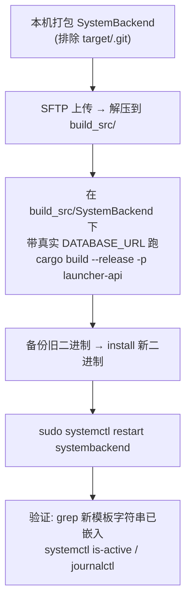

# 构建与部署

本页汇总客户端、后端、signer 的构建方式，以及后端部署到「家里云」生产环境的标准流程指针。

!!! warning "秘密不入文档"
    生产主机的 LAN IP、SSH 口令、DB 连接串、`config.toml` 内容、`admin_password`、私钥、HWID 盐**值**一律**不写入本站**。
    这些只存在于本机的 `CLAUDE.md`（已 gitignore）与服务器本地。本页只描述**流程与工件位置**，凭据一律按名字/角色引用。

## 1. 客户端（C++20 / Windows）

构建系统是 CMake + vcpkg（`CMakeLists.txt`）。

- 目标平台：**仅 Windows 11 x64**（`CMakeLists.txt:15-17` 对非 Windows `FATAL_ERROR`）。
- 工具链：`CMAKE_TOOLCHAIN_FILE` 指向 `$VCPKG_ROOT/scripts/buildsystems/vcpkg.cmake`（`CMakeLists.txt:3-4`），依赖清单在 `vcpkg.json`。
- C++ 标准：C++20，`CMAKE_CXX_EXTENSIONS OFF`（`CMakeLists.txt:11-13`）。
- **VMProtect 友好编译选项**（MSVC，`CMakeLists.txt:19-40`）：`/GR-`（无 RTTI）+ `/EHs-c-`（无异常）——这解释了客户端为何全程用 `Status`/`Result<T>` 错误码而非异常（见 [客户端概览](../client/index.md)）；另有 `/permissive- /Zc:__cplusplus /utf-8 /MP /W4`，Release 开 `/LTCG`。
- 预处理宏：`WIN32_LEAN_AND_MEAN / NOMINMAX / UNICODE / _UNICODE`。

```bash
# 典型配置 + 构建（需先设好 VCPKG_ROOT）
cmake --preset default          # 或 cmake -B build -S .
cmake --build build --config Release
```

!!! note "客户端主交付路径"
    可运行的 D2D 客户端在 `tools/preview-d2d/`（见 `docs/PHASE_2_D2D_MIGRATION.md`）；`src/` 是长期骨架。
    两者的 HWID 实现不同，详见 [客户端 · 加密与原生 §5](../client/crypto-native.md#hwid)。

### D2D 客户端构建脚本（`tools/preview-d2d/`）

D2D 客户端用两个 MSVC 批处理脚本（都自动定位 `vcvars64.bat`、cl 直接编译，非 CMake）：

- **`build_d2d.bat`** —— 正常构建，产出纯净 `LauncherD2D.exe`。
- **`build_d2d_visual.bat`** —— `build_d2d.bat` 的克隆 + 额外编入 `visual_smoke.cpp` + `/DLAUNCHER_VISUAL_SMOKE`，
  产出带**视觉冒烟钩子**的 exe。**不改** `build_d2d.bat`，保正常构建纯净、钩子在正常构建里编译为空翻译单元。
  跑冒烟：`build_d2d_visual.bat` 后 `set LAUNCHER_VISUAL_SMOKE=1` 启动（或加 `--visual-smoke`），逐屏 PNG 落
  `.visual-smoke/`。详见 [视觉冒烟测试](testing-visual-smoke.md)。

!!! note "生产 host 脱敏注入"
    两个脚本都通过环境变量 `LAUNCHER_DEFAULT_HOST` / `LAUNCHER_DEFAULT_SCHEME` / `LAUNCHER_DEFAULT_PORT` 注入生产
    地址，**不写死进源码**；未设置时回退到 `net.h` 内的 `127.0.0.1` 默认值。字面主机/端口按名引用，不入文档。

## 2. 后端（Rust workspace）

Cargo workspace 在 `SystemBackend/`（`SystemBackend/Cargo.toml`），四个 crate：`api` / `signer` / `proto` / `shared`。

- Rust 版本：`rust-version = "1.75"`（`Cargo.toml:16`），edition 2021。
- 运行二进制 **bin 名是 `systembackend`**（api crate）。
- Release profile：`lto = true`, `codegen-units = 1`, `strip = true`, `opt-level = 3`（`Cargo.toml:54-58`）。
- 关键依赖：axum 0.7、sqlx 0.8（postgres）、argon2、sha2、hmac、blake3、ed25519-dalek、askama、rustls 0.23（`Cargo.toml:18-52`）。

```bash
# 编译校验（需真实 DATABASE_URL 供 sqlx 宏离线/在线校验）
cargo build --release -p launcher-api    # 产出 bin: systembackend
cargo build --release -p signer         # 离线签名 CLI
```

!!! warning "sqlx 编译期校验与 .sqlx 缓存(接手必读)"
    sqlx `query!` 宏在编译期连库校验 SQL。**`.sqlx/` 缓存目录被 gitignore、不入库**(见 `.gitignore`),
    因此**干净 clone 后无法离线构建后端** —— 必须二选一:
    (a) 设 `DATABASE_URL` 指向一个有完整 schema 的 Postgres(本地起库跑 migration,或 SSH 隧道连生产库),
    在线校验构建;或 (b) 先在有库的环境跑 `cargo sqlx prepare` 生成 `.sqlx/`,再 `SQLX_OFFLINE=true cargo build`。
    生产部署走 (a):在服务器 `build_src/SystemBackend` 下带真实 `DATABASE_URL` 构建(见下方部署流程)。
    部分守卫(如 B2 owner-only)刻意用运行时 `query_scalar` 避开离线缓存依赖(`admin_users.rs:67-68`)。
    重建缓存 / SSH 隧道连生产 Postgres 的具体步骤见记忆 `backend-build-and-db-access`(本机 gitignore 文档)。

### 迁移

数据库迁移在 `SystemBackend/migrations/0001..0020`,服务启动时自动跑(`crates/api/src/main.rs:46-47`)。
`0019_media_thumbs.sql` 给 `media_files` 加 `blurhash`/`has_thumbs`,`0020_recall_reaction_media.sql` 加消息撤回
(`messages.recalled_at`)与反应媒体列(`message_reactions.sticker_ref`)。迁移均 additive + `IF NOT EXISTS`,对现网
旧行无破坏、可幂等重复登记。schema 详见
[数据模型](../data/data-model.md)。

### 配置

后端读 `config.toml`（`crates/api/src/main.rs:41-44`）。**其内容（`database_url`、`admin_password`、盐、`signing_public_key_hex`、TLS 证书路径、`cdn_base` 等）不写入本站**，字段清单见 `crates/shared/src/config.rs`；生产值只在服务器本地。

!!! warning "运维提醒：新增 `admin_cookie_secret` 配置项"
    admin 会话 cookie 现在用**独立**的 `admin_cookie_secret`（≥32 字节 hex）签名，而非复用 `admin_password`
    （`config.rs:57`、`state.rs:20-62`）。生产 `config.toml` **应显式配置**该项（值按名引用，只在服务器本地）——
    否则每次进程启动都随机生成新密钥，会使所有已登录 admin 会话在重启后失效（`state.rs:59-61` 会 `warn`）。

## 3. Signer（离线，管理员机器）

`signer` CLI 只在管理员机器运行，`keygen / sign / verify` 三个子命令，产出 `.helix`。私钥 `signer/private.key` 明文落盘、永不上服务器。完整用法与格式见 [Signer / Proto](../data/signer-proto.md)。

## 4. 部署到家里云（生产后端）

!!! warning "凭据在本机 gitignore 文档"
    生产主机地址、SSH 用户/口令、sudo 策略、DB 端口/库名/连接串位置等**全部记录在本机 `CLAUDE.md`（已 gitignore）**，
    本页不复制。以下只给**流程骨架**，具体主机/凭据以该文档为准。

模板是编译期嵌入二进制的，改后端/模板必须**重新构建 + 重启**才生效。标准流程（详见记忆 `homecloud-deploy-procedure`）：



要点（均来自本机 gitignore 文档，此处只述性质不述值）：

- systemd 服务名 `systembackend.service`（另有 `systembackend-audit.service` 双库）；运行二进制与部署源码快照的路径在服务器约定目录。
- **构建用普通部署用户**（其 cargo 在 `~/.cargo/bin`），**不要用 sudo/root 跑 cargo**（config.toml 对运行用户不可读的坑）。
- 本机无 sshpass/plink，用 **paramiko**（Python）做非交互 SSH/SFTP；SFTP 本地路径要用 Windows 实路径。
- **Wave 3 图片管线相关**：`media_thumb.rs` 依赖 `image` crate（解码/Lanczos3 缩放/JPEG-PNG 编码）+ `blurhash`
  crate，构建二进制体积/依赖较前增大，首次构建耗时更长。迁移 0019 幂等（`IF NOT EXISTS`），重复部署安全。
  部署后旧图仍走原图回退，直到 backfill（见 [图片管线 §3.4](../client/image-pipeline.md)）。config 需新增
  `admin_cookie_secret`（见上 §配置的运维提醒）。

!!! danger "部署即高风险操作"
    重启生产服务、替换二进制属于影响线上的操作。执行前确认已备份旧二进制、迁移兼容、并在 `journalctl` 复核启动无误。
    记忆 `rebind-expiry-auth-gap` 记录了一处「已修复但可能未部署」的差异——部署状态需实际在服务器确认，勿假设。

## 5. 文档站构建

本文档站是 MkDocs Material，构建/预览见 [文档流水线](doc-pipeline.md)。
