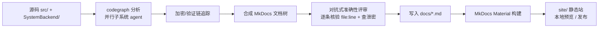

# 文档流水线（Doc Pipeline）

本页说明 Launcher 内部技术文档是**怎么生产、构建、发布**的 —— 从源码到可发布的 MkDocs Material 站点，
形成一条可重复的流水线。

!!! note "定位"
    面向**内部**开发/审计团队。可以写完整的信任模型、密钥流、验证链细节；但**任何会发布的文档都不得出现
    字面秘密**（内网 IP、SSH 密码、数据库连接串、`config.toml` 内容、`admin_password`、私钥、HWID 盐的**值**）。
    这条规则来自 `AGENTS.md`，是流水线里的硬约束。

## 1. 全景



三层产物：

1. **内容层** —— `docs/` 下的 markdown，由 codegraph workflow 依据**真实代码**生成，每条承重结论标 `file:line`。
2. **构建层** —— `mkdocs.yml` + MkDocs Material，把 markdown 编译成带搜索/导航/mermaid/代码高亮的静态站。
3. **发布层** —— `site/`（已 gitignore），可托管到任意静态服务器或内网。

## 2. 内容生产：codegraph workflow

文档内容不是手写，而是由一条 ultracode workflow 从代码里“读”出来的，保证与代码同步、有据可查。

- 脚本：`.claude/.../workflows/scripts/codegraph-docs.js`
- 阶段：
    1. **analyze** —— 每个子系统一个分析 agent（客户端 app/ui、net/storage、crypto/native；后端 auth、
       api/admin；signer/proto/数据模型），各自从真实代码构建“调用图 + 数据结构 + 控制/数据流”。
    2. **trace** —— 一个专职 agent 端到端追踪加密与验证链（密码 argon2id、HWID、session、Ed25519 验签、
       BLAKE3、DPAPI）。
    3. **synthesize** —— 合成成一致的 MkDocs 文档树，统一交叉引用。
    4. **review** —— 对抗式**准确性评审**：抽读被引用的 `file:line` 核验，杀掉臆造的函数/流程/参数，
       并扫描是否泄露字面秘密。
    5. **finalize** —— 把改好的 markdown 写进 `docs/`。

!!! warning "证据原则"
    每条非平凡结论必须能追到当前代码的 `path:line`。无法验证的写“unverified”，不臆造。已知弱点（如 HWID 不强制、
    admin `?key=` 旁路、cookie HMAC 复用 `admin_password`）用 `!!! warning` 标注并交叉引用安全审计，只描述**当前
    实际行为**，不在文档里编造尚未落地的修复。

## 3. 构建与预览

前置：Python 3 + `pip install mkdocs-material`（已装 mkdocs 1.6 + material 9.7）。

```bash
# 本地热预览（改 md 自动刷新），默认 http://127.0.0.1:8000
python -m mkdocs serve

# 构建静态站到 site/
python -m mkdocs build

# 严格模式构建（有坏链接/警告即失败，适合 CI 门禁）
python -m mkdocs build --strict
```

!!! note "PATH"
    `mkdocs.exe` 装在 `%APPDATA%\Python\Python3xx\Scripts`，可能不在 PATH。用 `python -m mkdocs ...`
    最稳，免去 PATH 问题。

## 4. 配置要点（`mkdocs.yml`）

- **主题** Material，中文 `language: zh`，亮/暗双主题切换。
- **markdown 扩展**：`admonition` + `pymdownx.details`（可折叠提示框）、`pymdownx.superfences`（mermaid 图）、
  `pymdownx.highlight`（行号 + 复制按钮）、`tables`、`toc`（锚点固定链接）。
- **搜索** 插件启用 zh + en。
- **导航** `nav:` 显式声明；codegraph 生成新页面后，把页面挂到 `nav` 对应分组下。

## 5. 加新文档 / 更新文档

1. 直接改 `docs/*.md`；或对某子系统重跑 codegraph workflow（改动的 agent 会重新读代码，未改的命中缓存）。
2. 新页面在 `mkdocs.yml` 的 `nav:` 里挂上。
3. `python -m mkdocs build --strict` 验证无坏链接。
4. 提交前 `git status --short` 复查，只提交源码/文档/脚本/migration；`site/` 不入库。

## 6. 发布

`site/` 是纯静态资源，可托管到：内网 nginx、对象存储静态站、或 `python -m mkdocs gh-deploy`（如接 Git 托管）。
发布前再次确认：**没有任何字面秘密进入 `docs/` 或 `site/`**。
