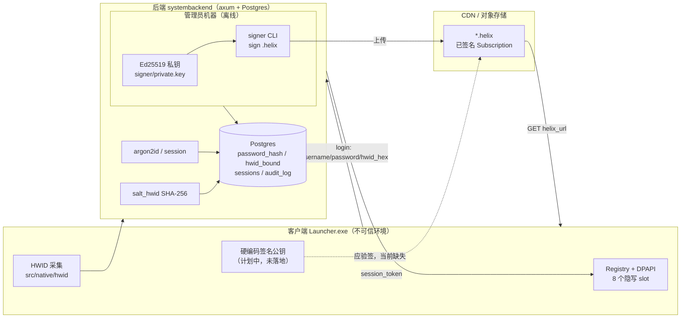
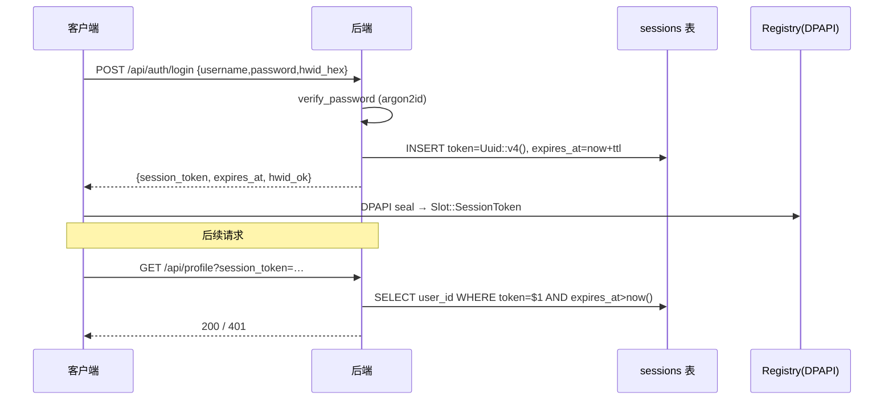

# 加密与验证链（端到端）

本章沿着**数据**追踪 Launcher 全部密码学与验证路径，跨越「客户端 / 后端 / 离线 signer」三个信任域。
每条链给出：算法、涉及的密钥或秘密（只写**名字与存放位置**，绝不写字面值）、精确代码路径（`file:line`）、以及它防的威胁。

!!! info "文档口径"
    - 所有结论均引用实际读过的代码行。无法验证的地方标注为「未实现 / unverified」，不臆造 API。
    - 涉及的秘密（HWID 盐、用户名盐、`admin_password`、签名私钥、DB 连接串等）一律按**名字/角色**引用，字面值只存在于服务器本地配置与管理员机器。
    - 已知弱点用 `!!! warning` 标出，并交叉引用安全审计；这里只描述**代码当前的真实行为**，不发明修复。

---

## 0. 信任边界总览



**信任模型三句话**（对齐 `docs/ARCHITECTURE.md:51`）：

- **客户端二进制**：公开物。持硬编码签名公钥（公开）+ HWID 盐（半公开，编译进二进制）。默认被视为可被逆向 / 篡改。
- **后端服务器**：持密码哈希、HWID 哈希、session token、`admin_password`；**不持签名私钥**。被打穿最多能改 `helix_url` 指向，但（设计上）伪造不了签名。
- **管理员机器**：唯一持 Ed25519 私钥处，离线 `sign` → 上传 CDN。

---

## 1. 密码：argon2id 哈希与校验

| 项 | 值 | 证据 |
|---|---|---|
| 算法 | Argon2id, Version `V0x13`, `parallelism=1` | `SystemBackend/crates/shared/src/hashing.rs:7-9` |
| 成本参数 | `argon_memory_kib`（默认 `128*1024` KiB）/ `argon_iterations`（默认 `10`） | `config.rs:12-16,55-60`；注入点 `auth.rs:136-141` |
| 存储格式 | PHC 字符串（含算法/参数/盐/hash），落 `users.password_hash` | `hashing.rs:11`，`auth.rs:146-159` |
| 盐 | 每次 `SaltString::generate(OsRng)`，随 PHC 串一起存 | `hashing.rs:6` |

注册时用配置参数哈希（`hash_password`，`auth.rs:136`）。登录校验走 `verify_password`：

```rust
// hashing.rs:14-19
pub fn verify_password(password: &str, encoded: &str) -> Result<bool, AppError> {
    let parsed = PasswordHash::new(encoded)?;
    Ok(Argon2::default()
        .verify_password(password.as_bytes(), &parsed)
        .is_ok())
}
```

!!! note "为什么校验用 `Argon2::default()` 而不是配置参数"
    Argon2id 的成本参数编码在 PHC 串里，`verify_password` 解析 `encoded` 后按串内参数重算，`Argon2::default()` 只提供算法框架，**不覆盖**串内参数。因此改配置里的成本值不会让旧哈希失效——这是 PHC 的预期行为，非缺陷。调用点 `auth.rs:313`。

**用户名查找哈希**：登录不按明文用户名查库，而按 `username_hash = salt_hwid(username, b"launcher.user.salt.v1")`（`auth.rs:66` 建、`auth.rs:296` 查）。即 `SHA-256("launcher.user.salt.v1" || username)`，见下节 `salt_hwid`。防的是 DB dump 直接得到用户名枚举。

**登录限流**：进程内 `login_attempts` map，15 分钟窗口 / 5 次失败 / 15 分钟冷却（`auth.rs:270-291`）。未知用户也计数，避免用户枚举时序侧信道（`auth.rs:302-311`）。

---

## 2. HWID：采集 → 服务端二次盐化 → 比对（advisory）

### 2.1 客户端采集

生产骨架 `src/native/hwid` 设计为 **14 项硬件源**（`src/native/hwid.h:30-46`）：主板序列号、BIOS UUID/版本、CPU 签名、系统盘序列号、卷序列号、物理 MAC、全网卡 MAC 哈希、GPU PNP ID/厂商、MachineGuid、TPM EK、SMBIOS UUID、显示器 EDID 哈希。

拼接固定顺序、用 `\x1F`/`\x1E` 作分隔，最后 SHA-256 → 64 hex：

```cpp
// src/native/hwid.cpp:303-316
Result<std::string> HwidCollector::collectFingerprint() {
    ...
    for (u8 i = 0; i < (u8)HwidPart::PartCount_; ++i) {
        blob += partName(p); blob += '\x1F';
        blob += r.value.get(p); blob += '\x1E';
    }
    return Result<std::string>{ sha256Hex(blob), 0 };
}
```

`sha256Hex` 用 libsodium `crypto_hash_sha256`（`hwid.cpp:171-176`）。严格度阈值：至少 8 项、且 4 个 core 项（系统盘/MachineGuid/主板/BIOS UUID）齐全，否则视为不可信（`hwid.h:67-68`，`hwid.cpp:296-300`）。

!!! warning "当前出货客户端用的是简化 HWID，不是 14 源版本"
    实际可运行的 D2D 客户端 `tools/preview-d2d/hwid.h:15-54` 只用
    `ComputerName + UserName + 系统盘 VolumeSerial` 经 Windows CryptoAPI SHA-256 得 64 hex。
    `src/native/hwid` 的 14 源严格实现**尚未接入主交付路径**（见 `docs/PROJECT_OUTLINE.md`，`src/` 为长期骨架）。
    简化指纹极易被复制（改机器名 + 卷序列号即可伪造），强度远低于设计目标。

### 2.2 服务端二次盐化

客户端把 64 位 hex 上报，后端**不直接存**，而是再盐化一次：

```rust
// hashing.rs:22-28  SHA-256(server_salt || hwid_hex)
pub fn salt_hwid(hwid_hex: &str, server_salt: &[u8]) -> String {
    let mut h = Sha256::new();
    h.update(server_salt);          // 盐名 launcher.hwid.salt.v1
    h.update(hwid_hex.as_bytes());
    hex::encode(h.finalize())
}
```

- 盐名 `launcher.hwid.salt.v1`（`auth.rs:142` 注册绑定、`auth.rs:341` 登录比对）。
- 存 `users.hwid_bound`。防「DB dump 即得明文 HWID」——但注意盐是编译期常量、半公开（见 `hashing.rs:21` 注释），拿到二进制即知盐，只挡不了针对性彩虹表之外的价值有限。

### 2.3 比对是「advisory」，不阻断登录

```rust
// auth.rs:342-358
// HWID 不匹配不再拒绝登录：换机/重装的用户仍要能进来发工单、走重绑流程。
let hwid_ok = match &row.hwid_bound {
    Some(bound) => bound == &hwid_salted,   // 不匹配也只是 hwid_ok=false
    None => { /* 首次登录：绑定当前 HWID */ true }
};
```

不匹配时 `hwid_ok=false` 回客户端做功能限制，并在 `login_history.failure_reason` 记 `hwid_mismatch`（`auth.rs:377-387`），但**不拒登录**。

!!! warning "审计-High：HWID 绑定不强制执行"
    后端把 HWID 作为咨询信号而非硬门禁（`auth.rs:342-344`）。任意持有效凭据者可从任意机器登录并拿到 session token；`hwid_ok` 的功能限制完全依赖**客户端自觉**执行——而客户端处于不可信环境，可被 patch 绕过。
    参见安全审计（记忆：`security-audit-2026-07`）中 HWID High 项。合法换机的正途是 §2.4 重绑流程。

### 2.4 HWID 重绑

`POST /api/hwid/rebind/request`（`rebind.rs`）需有效 session；管理员后台审核，批准时把 `users.hwid_bound` 改成新指纹（`rebind.rs:174-177`、`rebind.rs:353`）。

!!! note "已修复的越权：过期 token 曾能提交重绑"
    `rebind::submit` 早前的 session 查询缺 `AND expires_at > now()`，过期未删的 token 可创建重绑请求。当前代码已修（`rebind.rs:46` 与 `profile.rs:22` 一致）。据记忆 `rebind-expiry-auth-gap`，修复已编译但**部署状态需在 home cloud 再确认**；且提交的 `.sqlx` 离线缓存曾陈旧。

---

## 3. Session token：签发 → 存储 → 解析 → 过期



| 项 | 值 | 证据 |
|---|---|---|
| 生成 | `Uuid::new_v4().to_string()`（随机 v4，非签名令牌） | `auth.rs:361` |
| 有效期 | `now + session_ttl_seconds`（配置项） | `auth.rs:362`，`config.rs:8` |
| 服务端存储 | `sessions(token, user_id, expires_at, created_at)` | `auth.rs:364-374` |
| 客户端存储 | Registry `Slot::SessionToken`，DPAPI 封装 | `src/storage/registry.h:24`，`registry.cpp:98-110` |
| 解析 | `SELECT user_id FROM sessions WHERE token=$1 AND expires_at>now()` | `profile.rs:20-29`、`media.rs:33-40`、`subscription.rs:27-34`、`rebind.rs:46` |
| 注销 | `DELETE FROM sessions WHERE token=$1` | `auth.rs:411` |

!!! note "token 是不透明随机串，不是自校验令牌"
    session 是随机 UUID，服务端每次查库校验（含过期）。没有 JWT 式签名，因此撤销即时生效（删行），但也意味着每次鉴权一次 DB 往返。过期只靠 `expires_at > now()` 过滤，过期行不会自动删除（logout 才删）。

---

## 4. 内容签名：signer 离线签 .helix → CDN → 客户端验签 + BLAKE3

### 4.1 signer（管理员机器，离线）

Ed25519（`ed25519-dalek`）。三个子命令 `keygen / sign / verify`（`signer/src/main.rs:24-44`）。

**签名流程**（`main.rs:99-159`）：

1. 读游戏清单 TOML，对每个条目按 `file_path` 本地读文件算 **BLAKE3** 32 字节 `file_hash`（`main.rs:131`）。
2. 组装 `Subscription` proto，`signature` 字段先留空，`encode_to_vec()` 得待签字节。
3. `sk.sign(&unsigned)` 产生 64 字节 Ed25519 签名，写回 `signature` 字段后**重新** `encode_to_vec()` 落 `.helix`（`main.rs:150-156`）。

```rust
// main.rs:150-156
let unsigned = sub.encode_to_vec();      // signature 为空时的字节
let sk = load_signing_key(key)?;
let sig: Signature = sk.sign(&unsigned);
sub.signature = sig.to_bytes().to_vec();
let final_bytes = sub.encode_to_vec();   // 含签名再编码
fs::write(out_helix, final_bytes)?;
```

`verify`（`main.rs:161-184`）：取出 `signature` 字段清零后重编码得 `unsigned`，用公钥 `verify_strict`。

!!! note "D1 缓解：拒绝签「空 file_hash」清单"
    若条目只有 `download_url` 而无 `file_path`，signer 直接**拒签**（`main.rs:118-127`）。否则会签出带空 `file_hash` 的 manifest，客户端就无法把下载的二进制绑定到签名上，MITM/CDN 掉包可在有效签名下被接受。这是把「下载完整性」焊死在签名里的关键一环。

**密钥流**：`keygen` 写 `private.key`（32B raw）/`public.key`/`public.hex`（`main.rs:77-87`）。私钥名 `signer/private.key`，**只在管理员机器**；公钥 hex 同时进后端配置 `signing_public_key_hex`（`config.rs:17-18`）与（计划中的）客户端硬编码值。

### 4.2 分发与（应有的）客户端验签

- 客户端 `GET /api/subscription?session_token=…` 拿 `helix_url = {cdn_base}/sub/{id}.helix`（`subscription.rs:45-52`）。
- 从 CDN 拉 `.helix`（proto 见 `src/proto/subscription.proto`）。
- proto 约定：`signature`（field 15）为 64 字节 Ed25519，对前 14 个字段签（`subscription.proto:9-18`）。

!!! warning "客户端验签 + BLAKE3 校验 + 启动逻辑尚未落地（unverified in code）"
    `docs/ARCHITECTURE.md:36-43` 把「Ed25519 验签 → 解析 → BLAKE3 == file_hash → 启动」描述为既定流程，但在 `src/` 与 `tools/preview-d2d/` 中**均未找到**任何 Ed25519 验签、BLAKE3 校验或游戏启动实现（grep `verify_strict|blake3|Subscription|file_hash|launch` 仅命中 signer、proto 定义与 UI 回调桩）。
    当前只有：signer 能签、后端能发 `helix_url`、proto 已定义。**「客户端拒绝无效签名」这一信任模型的核心承诺，在客户端侧目前没有代码兜底。** 属产品路线 Phase D/E（`PROJECT_OUTLINE.md`）待实现。

!!! warning "proto 注释与 signer 实现不一致"
    `subscription.proto:6-7` 注释说「字节流 = Subscription 序列化 + **末尾** Ed25519 签名（不含在 `Subscription.signature` 里）」，但 signer 实际把签名写进 `signature` 字段（field 15）后**整体重编码**（`main.rs:153-155`）。将来实现客户端验签者若照 proto 注释「剥离尾部字节」去验，会与 signer 产物不匹配。以 signer 实现（清零 field 15 后重编码再验，见 `main.rs:165-169`）为准。

### 4.3 传输层

后端配了 `tls_cert_path`/`tls_key_path` 才跑 rustls，否则纯 HTTP（`main.rs:78-89`，`config.rs:26-31`）。客户端 `src/net/http_client.cpp:39` 留有 `CURLOPT_PINNEDPUBLICKEY` 证书 pinning 的 Phase 7 TODO——**当前无 pinning**。

!!! warning "传输保护取决于部署，且客户端无证书 pinning"
    是否 HTTPS 完全由服务器是否配 TLS 证书决定；生产可能以纯 HTTP 运行（见部署配置）。叠加客户端无 cert pinning，login 凭据与 session token 在链路上的机密性依赖网络环境。内容签名（§4.1）在传输被动窃听/篡改下仍能保护**清单完整性**（前提是 §4.2 客户端验签落地），但不保护凭据机密性。

---

## 5. 本地静态保护：DPAPI / 字符串混淆 / 动态导入

### 5.1 DPAPI 封装

`CryptProtectData` / `CryptUnprotectData`，`CRYPTPROTECT_UI_FORBIDDEN`，可选 entropy（`src/crypto/dpapi_seal.cpp:19-54`）。解封后 `SecureZeroMemory` 擦明文（`dpapi_seal.cpp:51`）。绑当前 Windows 用户，跨用户/跨机复制注册表值无法解密。

### 5.2 注册表隐写（8 slot）

8 个敏感 slot（`UsernameHash`/`PasswordToken`/`SessionToken`/`HwidBinding`/`LastLoginUtc`/`SubscriptionTier`/`SubscriptionExp`/`DeviceSeed`）分散到 8 个「看似系统遗留」的 HKCU 路径，每个真值旁撒 3~5 个同前缀假兄弟（`registry.cpp:31-92`、`sprinkleDecoys` `registry.cpp:170-179`）。写入前 `dpapiSeal`（`registry.cpp:98-109`）。

!!! warning "头文件注释声称的 AES-GCM 二次加密未实现"
    `src/storage/registry.h:8` 注释写「DPAPI(user) 封装 + **AES-GCM 二次加密（密钥 = HWID 派生）**」，且 `Slot::DeviceSeed` 注释称是「AES-GCM 派生 key 的 salt」（`registry.h:29`）。但 `registry.cpp:98-110` 的 `writeBytes` 只调用 `crypto::dpapiSeal(bytes)`——**没有 AES-GCM 层，DeviceSeed 未参与任何加密**，且 `dpapiSeal` 调用时未传 entropy（`registry.cpp:99`）。实际保护强度 = 单纯 DPAPI(user)。注释领先于实现，勿据注释判断强度。

### 5.3 字符串混淆 crypt_str

编译期 XOR，key 由「下标 i + 长度 n」派生（`src/crypto/crypt_str.h:18-23`），密文进 `.rdata`，明文不静态出现；解密到栈缓冲后 `memset` 擦栈（`crypt_str.h:37-45`）。种子 `kCryptStrSeed=0x5A` 编译期常量。

!!! note "crypt_str.cpp 是桩"
    `src/crypto/crypt_str.cpp` 仅 `crypt_str_keepalive()` 占位防链接器优化（`crypt_str.cpp:1-10`）；真正逻辑全在头文件模板。这是轻量反字符串聚类，非强加密——设计定位是「加壳（VMProtect）前先去掉显眼字符串」。

### 5.4 动态导入 dyn_api

`resolve_module`/`resolve_proc` 用 `GetModuleHandleA`/`LoadLibraryA` + `GetProcAddress` 运行时解析，配合 `CRYPT_STR("...")` 隐藏 DLL/函数名，避开静态 IAT（`src/native/dyn_api.cpp:9-21`，`dyn_api.h:16-21`）。刻意不缓存 module handle，防反作弊扫稳定 handle 表（`dyn_api.cpp:8`）。属 VMProtect 加壳前的导入隐藏铺垫。

---

## 6. 管理后台鉴权：cookie HMAC + `?key=` 引导

### 6.1 cookie HMAC-SHA256

登录成功签发 cookie `launcher_admin`，值 `issued_at:username:user_id:role:sig`（`admin.rs:144-162`）。签名：

```rust
// admin.rs:100-118  HMAC-SHA256, key = 独立的 admin_cookie_secret（非 admin_password）
let mut mac = HmacSha256::new_from_slice(state.admin_cookie_secret.as_slice())...;
mac.update(b"launcher.admin.session.v1:");
mac.update(issued_at.to_string().as_bytes()); ... username ... user_id ... role
```

HMAC 密钥是**独立的 32 字节 `admin_cookie_secret`**，与 `admin_password` 解耦（`state.rs:20-62`）：配置提供
≥32 字节 hex 则解码采用，否则启动用 `OsRng` 随机生成（`state.rs:45-63`）。校验 `verify_admin_cookie_sig` 用
`mac.verify_slice`（常量时间，`admin.rs:120-142`），再查 `issued_at` 新鲜度（≤12h 且不在未来，`admin.rs:183-186`）、
非 bootstrap 时回查 `admin_operators` 表确认 `enabled` 与 `user_id` 一致（`admin.rs:216-232`）。域
`launcher.admin.session.v1`。

### 6.2 bootstrap 登录

空用户名 + `password == admin_password` → 直接以 `role=owner` 发 bootstrap cookie（`admin.rs:336-347`）。有用户名则查 `admin_operators` JOIN `users` 校 argon2id 密码（`admin.rs:349-359`）。登录限流 5 次/15 分钟（`admin.rs:60-91`）。

### 6.3 `?key=` 引导路径

API 侧鉴权 `require_actor_or_admin_key`：先试 cookie session，否则 query `key == admin_password` 即授予 bootstrap actor（`admin_customization.rs:255-274`）。用于 `admin_users` 等 JSON API（`admin_users.rs:107-113,159-165,206-215`）。

!!! success "已修复：cookie HMAC 密钥独立于 admin_password（原审计 High）"
    admin cookie 的 HMAC key 曾复用 `admin_password`。当前是独立的 `admin_cookie_secret`（`admin.rs:107,131`、
    `state.rs:20-62`）。因此：(a) 泄露 `admin_password` 已**不能**离线伪造合法 cookie；(b) 会话完整性密钥与登录
    口令解耦，轮换口令不再连带登出。运维需在生产 `config.toml` 显式配置 `admin_cookie_secret`，否则每次重启随机
    生成会使已登录 admin 会话失效（`state.rs:59-61` 的 warn）。

!!! warning "审计项（仍开放）：`?key=admin_password` 明文出现在 URL"
    `require_actor_or_admin_key` 接受 query string 里的 `key`（`admin_customization.rs:265,270`）。URL 参数会进入访问日志、反代日志、浏览器历史、Referer，等于把最高权限口令写进多处明文，且可重放。属已知 bootstrap 后门路径，交叉引用安全审计中的 admin `?key=` bypass 项。

---

## 7. 全链速查表

| 链 | 算法 | 密钥/秘密（名字） | 主要证据 | 已知弱点 |
|---|---|---|---|---|
| 密码 | Argon2id | 每用户随机盐（存 PHC） | `hashing.rs:5-19`, `auth.rs:136,313` | — |
| 用户名查找 | SHA-256(salt‖name) | `launcher.user.salt.v1` | `auth.rs:66,296` | 盐半公开 |
| HWID | SHA-256×2 | `launcher.hwid.salt.v1` | `hwid.cpp:303`, `hashing.rs:22`, `auth.rs:341` | **不强制（High）**；出货用简化指纹 |
| Session | 随机 UUIDv4 + DB 校验 | 无（不透明串） | `auth.rs:361`, `profile.rs:20` | 过期行不自动清 |
| 内容签名 | Ed25519 + BLAKE3 | `signer/private.key` / `signing_public_key_hex` | `signer/main.rs:99-184` | **客户端验签未实现**；proto 注释不符 |
| 本地存储 | DPAPI(user) | Windows 用户主密钥 | `dpapi_seal.cpp`, `registry.cpp:98` | AES-GCM 层未实现（注释超前） |
| 字符串/导入混淆 | 编译期 XOR / 动态解析 | `kCryptStrSeed` | `crypt_str.h`, `dyn_api.cpp` | 轻量，非加密 |
| Admin 会话 | HMAC-SHA256 | 独立 `admin_cookie_secret`（随机/配置） | `admin.rs:100-142`、`state.rs:20-62` | key 已独立化（原「key=密码」已修）；`?key=admin_password` 明文 URL 仍开放 |

!!! danger "信任模型现状总结"
    设计上「服务器被打穿也伪造不了签名，因为客户端验签」——但**客户端验签当前无代码**（§4.2）。在落地前，`.helix` 内容完整性的实际保障仅停留在 signer 一侧；同时 HWID 门禁不强制（§2.3）、admin 仍存在 `?key=admin_password` 明文引导后门（§6.3）。这些是当前而非假想的缺口，随产品路线 Phase D/E 收敛。（原「cookie HMAC 密钥复用口令」已修——见 §6.1 的 success 框。）
