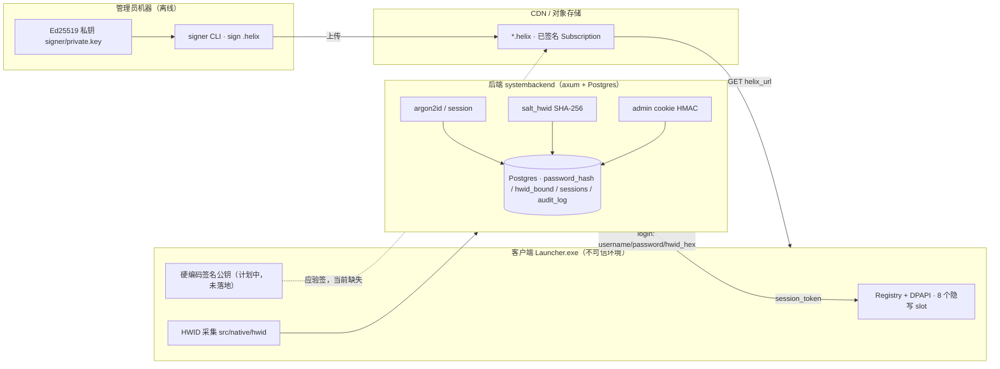

# 安全与信任模型

本章是 Launcher 安全视角的入口，把三个信任域的密码学、验证链与已知弱点集中呈现。核心内容有两页：

- **本页** —— 信任边界总述 + **已知弱点总清单**（按严重度），每条交叉引用到具体子系统页与代码。
- **[加密与验证链](crypto-chain.md)** —— 沿数据端到端追踪每条密码学路径（密码、HWID、session、Ed25519 验签、BLAKE3、DPAPI、admin cookie HMAC），给出算法、密钥名/角色、`file:line` 证据与所防威胁。

!!! info "文档口径"
    涉及的秘密（HWID 盐 `launcher.hwid.salt.v1`、用户名盐 `launcher.user.salt.v1`、`admin_password`、签名私钥
    `signer/private.key` 等）一律按**名字/角色**引用，字面值只存在于服务器本地配置与管理员机器。
    已知弱点只描述**代码当前的真实行为**，不发明尚未落地的修复。

## 信任边界总览

信任模型三句话（详见 [架构总览](../architecture/index.md)）：

- **客户端二进制**：公开物，持硬编码签名公钥（公开）+ HWID 盐（半公开）。默认可被逆向/篡改。
- **后端服务器**：持密码哈希、HWID 哈希、session token、`admin_password`；**不持签名私钥**。
- **管理员机器**：唯一持 Ed25519 私钥处，离线 `sign` → 上传 CDN。

## 已知弱点总清单 {#hwid}

下列均为**当前代码的真实行为**，对齐记忆中的 `security-audit-2026-07`。修复优先级与详细威胁分析见对应子系统页与 [加密与验证链](crypto-chain.md)。

| # | 严重度 | 弱点 | 证据 | 详见 |
|---|---|---|---|---|
| 1 | **High** | HWID 绑定不在后端强制（advisory），功能限制依赖不可信客户端 | `auth.rs:342-358,262,398` | [认证/会话 §5](../backend/auth-session.md#5)、[加密链 §2.3](crypto-chain.md) |
| 2 | **High** | admin `?key=admin_password` 明文 URL 旁路，等同 owner 全权 | `admin_customization.rs:255-274`；`admin_users.rs:107,159,212`、`market.rs:464`、`rebind.rs:153,204` | [API 与管理后台 §5](../backend/api-admin.md#5)、[加密链 §6.3](crypto-chain.md) |
| 3 | Medium | bootstrap-owner 常驻后门：知 `admin_password` 即可无用户名登录为 owner，不可禁用 | `admin.rs:336-346` | [API 与管理后台 §5](../backend/api-admin.md#5) |
| 4 | Medium | 明文 HTTP 传输（生产无 TLS）+ 客户端无证书 pinning | `main.rs:79-90`；`http_client.cpp:39` TODO | [加密链 §4.3](crypto-chain.md)、[客户端 · 网络](../client/net-storage-core.md#http) |
| 5 | Medium | 客户端验签 / BLAKE3 校验 / 启动全未实现——信任模型核心承诺无代码兜底 | grep `src/`、`tools/preview-d2d/` 无命中 | [数据流 · 启动游戏](../architecture/data-flow.md#4)、[加密链 §4.2](crypto-chain.md) |
| 6 | Medium | 出货客户端用简化 HWID（ComputerName+UserName+VolumeSerial），非 14 源设计 | `tools/preview-d2d/hwid.h:15-54` | [客户端 · 加密与原生 §5](../client/crypto-native.md#hwid) |
| 7 | Low | HWID/username 仅单遍 SHA-256（盐半公开），泄盐后可离线比对 | `hashing.rs:22-28` | [认证/会话 §2](../backend/auth-session.md) |
| 8 | Low | 登录限流为进程内 `Mutex<HashMap>`，重启即清空、多实例各自计数（锁已 poison-safe） | `state.rs:19`, `auth.rs:276-291` | [认证/会话 §4](../backend/auth-session.md#4) |
| 9 | Low | 过期 session 行不自动清理（仅查询谓词过滤） | `auth.rs` 全文无清扫任务 | [认证/会话 §6](../backend/auth-session.md) |
| 10 | Low | 私钥 `signer/private.key` 明文落盘，无口令加密 | `signer/main.rs:81` | [Signer / Proto §1.2](../data/signer-proto.md) |
| 11 | Info | registry.h 注释承诺的 AES-GCM 二次加密未实现，实际 = 单纯 DPAPI(user) | `registry.h:8,29` vs `registry.cpp:99` | [客户端 · 加密与原生 §4](../client/crypto-native.md#4) |

!!! note "已在源码中修复的历史项"
    - **admin cookie HMAC 密钥独立化**（原 High #3）：admin 会话 cookie 的 HMAC-SHA256 不再复用 `admin_password`，
      而是用独立的 `admin_cookie_secret`——配置提供 ≥32 字节 hex 则用之，否则启动随机生成（`state.rs:20-62`、
      `admin.rs:107,131`）。这切断了「口令=签名密钥」的耦合：现在泄露 `admin_password` 无法离线伪造合法 cookie，
      改密码也不再使已登录会话失效。（`?key=` 旁路仍比对 `admin_password`，见 #2。）
    - **register UTF-8 panic 守卫**：`register` 现在前置校验 `hwid_hex` 长度==64 且全为 ascii-hex（`auth.rs:58-63`），
      与 `login`（`auth.rs:270`）一致，消除对非 ASCII 边界切片的 panic 面。
    - **登录限流锁 poison-safe**：`login_attempts` 的锁不再 `.unwrap()` panic，改用 `unwrap_or_else(|e| e.into_inner())`
      在锁中毒时恢复（`auth.rs:276`）；`admin.rs:89,95` 同样宽松处理。
    - **M-2 登录时序旁路**：未知用户登录时跑一次用启动预算的 `dummy_password_hash`（成本参数与真实密码一致，
      `state.rs:23,29-34`、`auth.rs:316-318`），消除用户枚举时序侧信道。
    - **rebind 过期 token 旁路**：`rebind::submit` 现在校验 `expires_at > now()`（`rebind.rs:46`），记忆中记录的
      「过期 session token 被 rebind::submit 接受」在当前源码已收敛，与 `rebind.rs:108` 逐字一致。

!!! danger "信任模型现状总结"
    设计上「服务器被打穿也伪造不了签名，因为客户端验签」——但**客户端验签当前无代码**（#5）。在落地前，`.helix`
    内容完整性的实际保障仅停留在 signer 一侧；同时 HWID 门禁不强制（#1）、admin 仍存在 `?key=admin_password`
    明文引导后门（#2）。这些是当前而非假想的缺口，随产品路线 Phase D/E 收敛。（原 High「cookie HMAC 密钥复用口令」
    已修，见上「已修复历史项」。）
